# Chức năng và luồng nghiệp vụ của ENG//HABIT

> Tài liệu mô tả **toàn bộ chức năng** và **các luồng nghiệp vụ** của hệ thống, kèm sơ đồ
> use case và sơ đồ luồng viết bằng Mermaid.
>
> **Nguồn:** quét trực tiếp mã nguồn ngày 20/09/2026, bổ sung ngày 21/09/2026 (thêm Việc cần
> làm) và 22/09/2026 (thói quen tự động, mục tiêu cộng dồn, kết thúc và tạm dừng mục tiêu, nhắc
> theo giờ của thói quen, đăng nhập so khớp chính xác, nhật ký thao tác quản trị) — 17 module ở `be/src/modules`, 2 cron ở `be/src/jobs`, bản đồ route ở
> `fe/src/routes/AppRoutes.tsx`, hằng số nghiệp vụ ở `shared/src`. Mọi con số (giá xu, ngưỡng,
> giới hạn) lấy từ code, không lấy từ tài liệu cũ.
>
> Tài liệu đi kèm: `docs/phan-tich-do-an.md` (mô tả tổng thể, cập nhật cùng ngày) và
> `docs/logic-nghiep-vu/` (logic từng module: cách hoạt động, liên kết, ảnh hưởng dây chuyền).
>
> Đặc tả chi tiết từng phân hệ vẫn nằm ở tài liệu riêng — file này chỉ tổng hợp và trỏ tới:
> `ke-hoach-hoc-on-flashcard.md`, `luong-quen-mat-khau.md`, `ke-hoach-cua-hang-vat-pham.md`,
> `ke-hoach-quan-ly-tinh-nang.md`, `ke-hoach-viec-can-lam.md`.

---

## Mục lục

1. [Tác nhân](#1-tác-nhân)
2. [Sơ đồ use case](#2-sơ-đồ-use-case)
3. [Danh mục chức năng](#3-danh-mục-chức-năng)
4. [Luồng nghiệp vụ](#4-luồng-nghiệp-vụ)
5. [Ma trận quyền và cờ tính năng](#5-ma-trận-quyền-và-cờ-tính-năng)
6. [Bất biến toàn hệ thống](#6-bất-biến-toàn-hệ-thống)

---

## 1. Tác nhân

| Tác nhân | Là ai | Vào hệ thống bằng |
|---|---|---|
| **Khách** | Người chưa đăng nhập | Ba màn công khai: `/login`, `/register`, `/forgot-password` |
| **Người học** (`USER`) | Người dùng cuối | Mọi màn học tập, xã hội, phần thưởng. Guard `Learner` / `Gated` |
| **Quản trị viên** (`ADMIN`) | Người vận hành | Chỉ khu `/admin/*`. Không có streak, XP, xu, nhắc nhở |
| **Trưởng nhóm** | Người học có vai trò `LEADER` trong một nhóm | Vai trò **theo từng nhóm**, không phải vai trò hệ thống |
| **Hệ thống (cron)** | Hai tiến trình nền trong `be/src/jobs` | Tự chạy theo lịch, không đăng nhập |
| **OneSignal** | Dịch vụ ngoài | Chỉ là **kênh gửi** push. Không tự lên lịch |

Hai điểm dễ nhầm:

- **Quản trị viên KHÔNG kế thừa chức năng của Người học.** Hai vai trò chỉ chung nhau phần
  tài khoản (đăng nhập, hồ sơ, đổi mật khẩu) và chuông thông báo. Backend chặn bằng
  `requireRole(UserRole.USER)` ở tầng router của mọi module học tập — ẩn giao diện là chưa đủ.
- **Trưởng nhóm là một Người học**, không phải tác nhân riêng về quyền hệ thống. Quyền
  trưởng nhóm được kiểm tra bằng `assertLeader(groupId, userId)` trong `group.service.ts`.

---

## 2. Sơ đồ use case

Mermaid không có loại sơ đồ use case riêng. Các sơ đồ dưới dùng `flowchart`: **hình chữ
nhật** là tác nhân, **hình viên thuốc** là use case, **khung** là ranh giới phân hệ. Mũi
tên nét đứt `«include»` là use case luôn chạy kèm, `«extend»` là use case chạy có điều kiện.

### 2.1 Tổng quan — các phân hệ

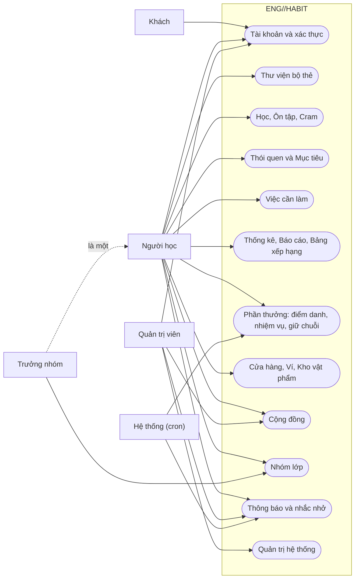
```mermaid
flowchart LR
    Guest["Khách"]
    Learner["Người học"]
    Leader["Trưởng nhóm"]
    Admin["Quản trị viên"]
    Cron["Hệ thống (cron)"]

    subgraph SYS["ENG//HABIT"]
        direction TB
        P1(["Tài khoản và xác thực"])
        P2(["Thư viện bộ thẻ"])
        P3(["Học, Ôn tập, Cram"])
        P4(["Thói quen và Mục tiêu"])
        P12(["Việc cần làm"])
        P5(["Thống kê, Báo cáo, Bảng xếp hạng"])
        P6(["Phần thưởng: điểm danh, nhiệm vụ, giữ chuỗi"])
        P7(["Cửa hàng, Ví, Kho vật phẩm"])
        P8(["Cộng đồng"])
        P9(["Nhóm lớp"])
        P10(["Thông báo và nhắc nhở"])
        P11(["Quản trị hệ thống"])
    end

    Guest --> P1
    Learner --> P1
    Learner --> P2
    Learner --> P3
    Learner --> P4
    Learner --> P12
    Learner --> P5
    Learner --> P6
    Learner --> P7
    Learner --> P8
    Learner --> P9
    Learner --> P10
    Leader --> P9
    Admin --> P1
    Admin --> P10
    Admin --> P11
    Admin --> P8
    Cron --> P6
    Cron --> P10
    Leader -.->|"là một"| Learner
```

### 2.2 Tài khoản và xác thực

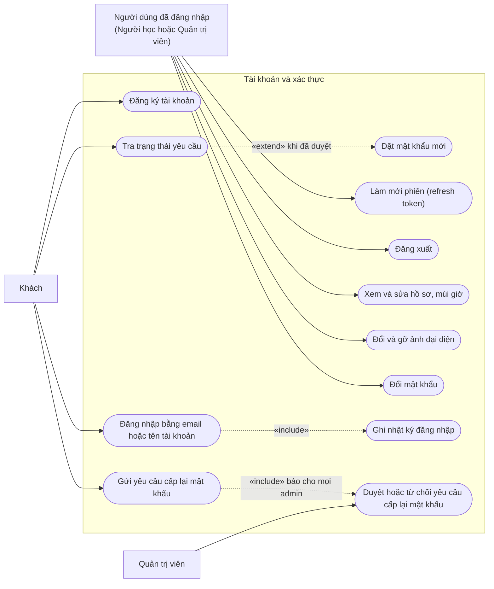
```mermaid
flowchart LR
    Guest["Khách"]
    User["Người dùng đã đăng nhập<br/>(Người học hoặc Quản trị viên)"]
    Admin["Quản trị viên"]

    subgraph AUTH["Tài khoản và xác thực"]
        direction TB
        UC1(["Đăng ký tài khoản"])
        UC2(["Đăng nhập bằng email hoặc tên tài khoản"])
        UC3(["Gửi yêu cầu cấp lại mật khẩu"])
        UC4(["Tra trạng thái yêu cầu"])
        UC5(["Đặt mật khẩu mới"])
        UC6(["Làm mới phiên (refresh token)"])
        UC7(["Đăng xuất"])
        UC8(["Xem và sửa hồ sơ, múi giờ"])
        UC9(["Đổi và gỡ ảnh đại diện"])
        UC10(["Đổi mật khẩu"])
        UC11(["Ghi nhật ký đăng nhập"])
        UC12(["Duyệt hoặc từ chối yêu cầu cấp lại mật khẩu"])
    end

    Guest --> UC1
    Guest --> UC2
    Guest --> UC3
    Guest --> UC4
    UC4 -.->|"«extend» khi đã duyệt"| UC5
    UC2 -.->|"«include»"| UC11
    User --> UC6
    User --> UC7
    User --> UC8
    User --> UC9
    User --> UC10
    Admin --> UC12
    UC3 -.->|"«include» báo cho mọi admin"| UC12
```

### 2.3 Học tập — Thư viện, Học, Ôn tập

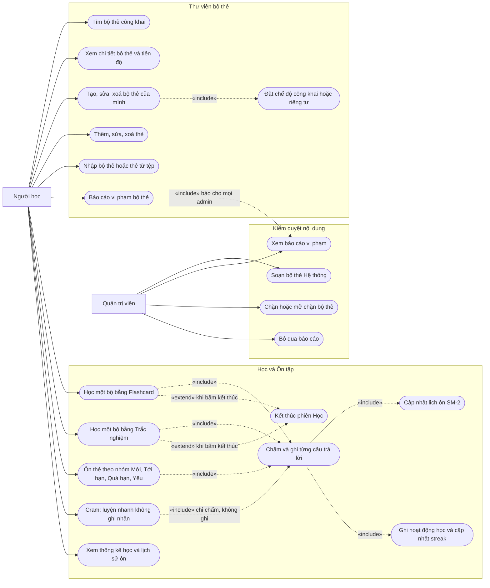
```mermaid
flowchart LR
    Learner["Người học"]
    Admin["Quản trị viên"]

    subgraph LIB["Thư viện bộ thẻ"]
        direction TB
        L1(["Tìm bộ thẻ công khai"])
        L2(["Xem chi tiết bộ thẻ và tiến độ"])
        L3(["Tạo, sửa, xoá bộ thẻ của mình"])
        L4(["Đặt chế độ công khai hoặc riêng tư"])
        L5(["Thêm, sửa, xoá thẻ"])
        L6(["Nhập bộ thẻ hoặc thẻ từ tệp"])
        L7(["Báo cáo vi phạm bộ thẻ"])
    end

    subgraph STUDY["Học và Ôn tập"]
        direction TB
        S1(["Học một bộ bằng Flashcard"])
        S2(["Học một bộ bằng Trắc nghiệm"])
        S3(["Ôn thẻ theo nhóm Mới, Tới hạn, Quá hạn, Yếu"])
        S4(["Cram: luyện nhanh không ghi nhận"])
        S5(["Chấm và ghi từng câu trả lời"])
        S6(["Cập nhật lịch ôn SM-2"])
        S7(["Ghi hoạt động học và cập nhật streak"])
        S8(["Kết thúc phiên Học"])
        S9(["Xem thống kê học và lịch sử ôn"])
    end

    subgraph MOD["Kiểm duyệt nội dung"]
        direction TB
        M1(["Soạn bộ thẻ Hệ thống"])
        M2(["Xem báo cáo vi phạm"])
        M3(["Chặn hoặc mở chặn bộ thẻ"])
        M4(["Bỏ qua báo cáo"])
    end

    Learner --> L1
    Learner --> L2
    Learner --> L3
    Learner --> L5
    Learner --> L6
    Learner --> L7
    L3 -.->|"«include»"| L4
    Learner --> S1
    Learner --> S2
    Learner --> S3
    Learner --> S4
    Learner --> S9
    S1 -.->|"«include»"| S5
    S2 -.->|"«include»"| S5
    S3 -.->|"«include»"| S5
    S4 -.->|"«include» chỉ chấm, không ghi"| S5
    S5 -.->|"«include»"| S6
    S5 -.->|"«include»"| S7
    S1 -.->|"«extend» khi bấm kết thúc"| S8
    S2 -.->|"«extend» khi bấm kết thúc"| S8
    Admin --> M1
    Admin --> M2
    Admin --> M3
    Admin --> M4
    L7 -.->|"«include» báo cho mọi admin"| M2
```

### 2.4 Thói quen, Mục tiêu, Việc cần làm, Thống kê, Phần thưởng, Cửa hàng

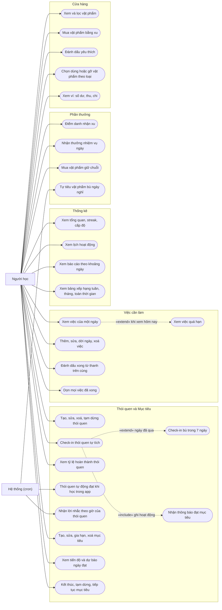
```mermaid
flowchart LR
    Learner["Người học"]
    Cron["Hệ thống (cron)"]

    subgraph HAB["Thói quen và Mục tiêu"]
        direction TB
        H1(["Tạo, sửa, xoá, tạm dừng thói quen"])
        H2(["Check-in thói quen tự tích"])
        H3(["Check-in bù trong 7 ngày"])
        H4(["Xem tỷ lệ hoàn thành thói quen"])
        H5(["Thói quen tự động đạt khi học trong app"])
        H6(["Nhận lời nhắc theo giờ của thói quen"])
        G1(["Tạo, sửa, gia hạn, xoá mục tiêu"])
        G2(["Xem tiến độ và dự báo ngày đạt"])
        G3(["Nhận thông báo đạt mục tiêu"])
        G4(["Kết thúc, tạm dừng, tiếp tục mục tiêu"])
    end

    subgraph TODOS["Việc cần làm"]
        direction TB
        D1(["Xem việc của một ngày"])
        D2(["Xem việc quá hạn"])
        D3(["Thêm, sửa, dời ngày, xoá việc"])
        D4(["Đánh dấu xong từ thanh trên cùng"])
        D5(["Dọn mọi việc đã xong"])
    end

    subgraph STAT["Thống kê"]
        direction TB
        T1(["Xem tổng quan, streak, cấp độ"])
        T2(["Xem lịch hoạt động"])
        T3(["Xem báo cáo theo khoảng ngày"])
        T4(["Xem bảng xếp hạng tuần, tháng, toàn thời gian"])
    end

    subgraph REW["Phần thưởng"]
        direction TB
        R1(["Điểm danh nhận xu"])
        R2(["Nhận thưởng nhiệm vụ ngày"])
        R3(["Mua vật phẩm giữ chuỗi"])
        R4(["Tự tiêu vật phẩm bù ngày nghỉ"])
    end

    subgraph SHOP["Cửa hàng"]
        direction TB
        C1(["Xem và lọc vật phẩm"])
        C2(["Mua vật phẩm bằng xu"])
        C3(["Đánh dấu yêu thích"])
        C4(["Chọn dùng hoặc gỡ vật phẩm theo loại"])
        C5(["Xem ví: số dư, thu, chi"])
    end

    Learner --> H1
    Learner --> H2
    H2 -.->|"«extend» ngày đã qua"| H3
    Learner --> H4
    Cron --> H5
    Cron --> H6
    Learner --> G1
    Learner --> G2
    Learner --> G4
    H2 -.->|"«include» ghi hoạt động"| G3
    Learner --> D1
    Learner --> D3
    Learner --> D4
    Learner --> D5
    D1 -.->|"«extend» khi xem hôm nay"| D2
    Learner --> T1
    Learner --> T2
    Learner --> T3
    Learner --> T4
    Learner --> R1
    Learner --> R2
    Learner --> R3
    Cron --> R4
    Learner --> C1
    Learner --> C2
    Learner --> C3
    Learner --> C4
    Learner --> C5
```

### 2.5 Xã hội — Cộng đồng và Nhóm lớp

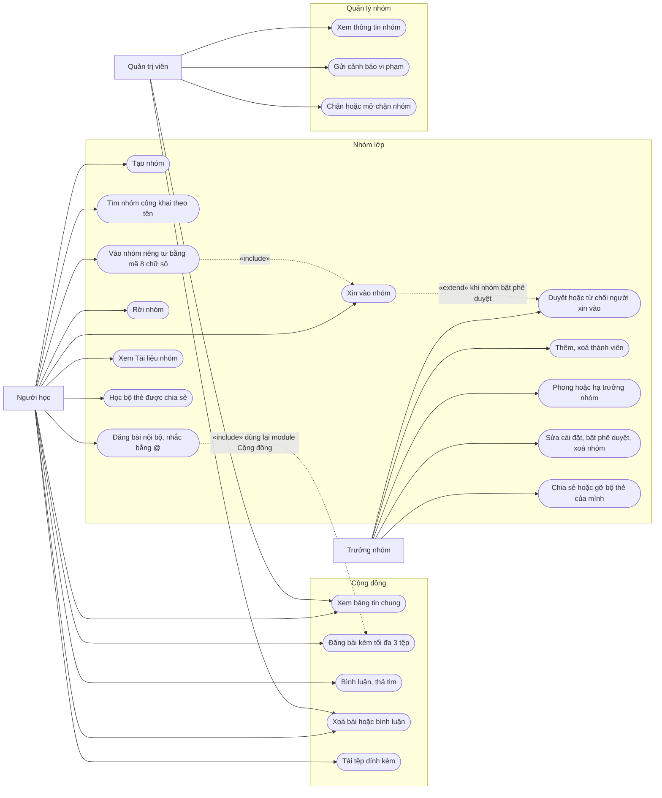
```mermaid
flowchart LR
    Learner["Người học"]
    Leader["Trưởng nhóm"]
    Admin["Quản trị viên"]

    subgraph COM["Cộng đồng"]
        direction TB
        P1(["Xem bảng tin chung"])
        P2(["Đăng bài kèm tối đa 3 tệp"])
        P3(["Bình luận, thả tim"])
        P4(["Xoá bài hoặc bình luận"])
        P5(["Tải tệp đính kèm"])
    end

    subgraph GRP["Nhóm lớp"]
        direction TB
        G1(["Tạo nhóm"])
        G2(["Tìm nhóm công khai theo tên"])
        G3(["Vào nhóm riêng tư bằng mã 8 chữ số"])
        G4(["Xin vào nhóm"])
        G5(["Rời nhóm"])
        G6(["Đăng bài nội bộ, nhắc bằng @"])
        G7(["Xem Tài liệu nhóm"])
        G8(["Học bộ thẻ được chia sẻ"])
        G9(["Duyệt hoặc từ chối người xin vào"])
        G10(["Thêm, xoá thành viên"])
        G11(["Phong hoặc hạ trưởng nhóm"])
        G12(["Sửa cài đặt, bật phê duyệt, xoá nhóm"])
        G13(["Chia sẻ hoặc gỡ bộ thẻ của mình"])
    end

    subgraph AGRP["Quản lý nhóm"]
        direction TB
        A1(["Xem thông tin nhóm"])
        A2(["Gửi cảnh báo vi phạm"])
        A3(["Chặn hoặc mở chặn nhóm"])
    end

    Learner --> P1
    Learner --> P2
    Learner --> P3
    Learner --> P4
    Learner --> P5
    Admin --> P1
    Admin --> P4
    Learner --> G1
    Learner --> G2
    Learner --> G3
    Learner --> G4
    Learner --> G5
    Learner --> G6
    Learner --> G7
    Learner --> G8
    G3 -.->|"«include»"| G4
    Leader --> G9
    Leader --> G10
    Leader --> G11
    Leader --> G12
    Leader --> G13
    G4 -.->|"«extend» khi nhóm bật phê duyệt"| G9
    G6 -.->|"«include» dùng lại module Cộng đồng"| P2
    Admin --> A1
    Admin --> A2
    Admin --> A3
```

### 2.6 Thông báo và nhắc nhở

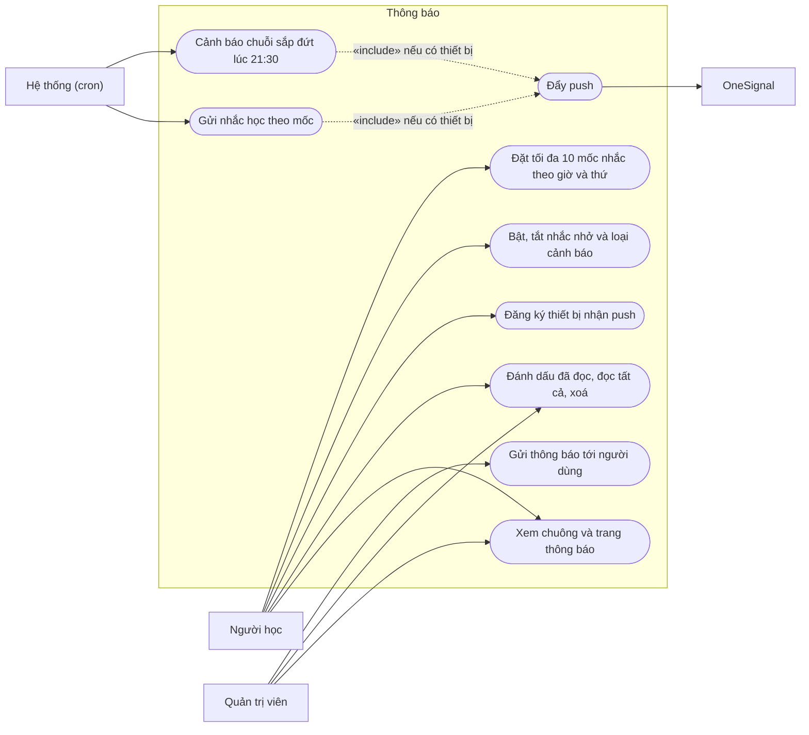
```mermaid
flowchart LR
    Learner["Người học"]
    Admin["Quản trị viên"]
    Cron["Hệ thống (cron)"]
    OS["OneSignal"]

    subgraph NOTI["Thông báo"]
        direction TB
        N1(["Xem chuông và trang thông báo"])
        N2(["Đánh dấu đã đọc, đọc tất cả, xoá"])
        N3(["Đăng ký thiết bị nhận push"])
        N4(["Bật, tắt nhắc nhở và loại cảnh báo"])
        N5(["Đặt tối đa 10 mốc nhắc theo giờ và thứ"])
        N6(["Gửi nhắc học theo mốc"])
        N7(["Cảnh báo chuỗi sắp đứt lúc 21:30"])
        N8(["Gửi thông báo tới người dùng"])
        N9(["Đẩy push"])
    end

    Learner --> N1
    Learner --> N2
    Learner --> N3
    Learner --> N4
    Learner --> N5
    Admin --> N1
    Admin --> N2
    Admin --> N8
    Cron --> N6
    Cron --> N7
    N6 -.->|"«include» nếu có thiết bị"| N9
    N7 -.->|"«include» nếu có thiết bị"| N9
    N9 --> OS
```

### 2.7 Quản trị

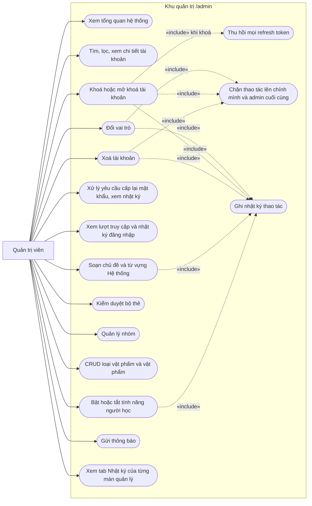
```mermaid
flowchart LR
    Admin["Quản trị viên"]

    subgraph ADM["Khu quản trị /admin"]
        direction TB
        A1(["Xem tổng quan hệ thống"])
        A2(["Tìm, lọc, xem chi tiết tài khoản"])
        A3(["Đổi vai trò"])
        A4(["Khoá hoặc mở khoá tài khoản"])
        A5(["Xoá tài khoản"])
        A6(["Thu hồi mọi refresh token"])
        A7(["Chặn thao tác lên chính mình và admin cuối cùng"])
        A8(["Xử lý yêu cầu cấp lại mật khẩu, xem nhật ký"])
        A9(["Xem lượt truy cập và nhật ký đăng nhập"])
        A10(["Soạn chủ đề và từ vựng Hệ thống"])
        A11(["Kiểm duyệt bộ thẻ"])
        A12(["Quản lý nhóm"])
        A13(["CRUD loại vật phẩm và vật phẩm"])
        A14(["Bật hoặc tắt tính năng người học"])
        A15(["Gửi thông báo"])
        A16(["Ghi nhật ký thao tác"])
        A17(["Xem tab Nhật ký của từng màn quản lý"])
    end

    Admin --> A1
    Admin --> A2
    Admin --> A3
    Admin --> A4
    Admin --> A5
    Admin --> A8
    Admin --> A9
    Admin --> A10
    Admin --> A11
    Admin --> A12
    Admin --> A13
    Admin --> A14
    Admin --> A15
    Admin --> A17
    A3 -.->|"«include»"| A16
    A4 -.->|"«include»"| A16
    A5 -.->|"«include»"| A16
    A10 -.->|"«include»"| A16
    A14 -.->|"«include»"| A16
    A4 -.->|"«include» khi khoá"| A6
    A3 -.->|"«include»"| A7
    A4 -.->|"«include»"| A7
    A5 -.->|"«include»"| A7
```

---

## 3. Danh mục chức năng

Mỗi bảng: chức năng → màn hình FE → endpoint BE → quy tắc nghiệp vụ chính. Mọi endpoint có
tiền tố `/api/v1`.

### 3.1 Tài khoản và xác thực — module `auth`

| Chức năng | Màn | Endpoint | Quy tắc |
|---|---|---|---|
| Đăng ký | `/register` | `POST /auth/register` | Email và tên tài khoản đều unique. Kiểm trước để báo đúng trường trùng; ràng buộc DB mới là thứ chặn thật (bắt `P2002`). Timezone mặc định `Asia/Ho_Chi_Minh` |
| Đăng nhập | `/login` | `POST /auth/login` | Nhận **email hoặc tên tài khoản**, so khớp **chính xác**: tên tài khoản phân biệt hoa thường và khoảng trắng (`User`, `" user "` không vào được tài khoản `user`), email không phân biệt hoa thường. BE kiểm lại trong JS vì collation MySQL tự bỏ qua hoa thường và khoảng trắng cuối. Sai tài khoản và sai mật khẩu trả **cùng một** thông báo. Tài khoản `LOCKED` báo rõ lý do (mật khẩu đã đúng nên không lộ gì thêm). Mọi lần thử đều ghi `LoginEvent` |
| Làm mới phiên | — | `POST /auth/refresh` | Refresh token trong cookie, **xoay vòng**: dùng một lần rồi cấp token mới |
| Đăng xuất | — | `POST /auth/logout` | Thu hồi refresh token hiện tại |
| Quên mật khẩu | `/forgot-password` | `POST /auth/password-reset/request`, `/confirm` | Không gửi email. Quản trị viên duyệt tay; người dùng tự đặt mật khẩu mới. Chi tiết mục 4.3 |
| Hồ sơ | `/profile` | `GET`, `PATCH /auth/me` | Sửa tên, múi giờ |
| Ảnh đại diện | `/profile` | `PUT`, `DELETE /auth/me/avatar` | Tối đa 200 KB, lưu blob ở bảng `user_avatars` |
| Đổi mật khẩu | `/profile` | `POST /auth/me/change-password` | Phải nhập đúng mật khẩu hiện tại. Đổi xong **thu hồi mọi phiên** ở thiết bị khác |

### 3.2 Thư viện bộ thẻ — module `library`

Bộ thẻ là bảng `topics`, thẻ là bảng `vocabulary`. `ownerId = null` là bộ **Hệ thống** do
quản trị viên soạn.

| Chức năng | Màn | Endpoint | Quy tắc |
|---|---|---|---|
| Khám phá bộ công khai | `/library` | `GET /library/sets` | Chỉ bộ `PUBLIC`, chưa bị chặn, chủ còn `ACTIVE` (hoặc bộ Hệ thống) |
| Bộ của tôi | `/library` | `GET /library/sets/mine` | |
| Chi tiết bộ | `/library/:id` | `GET /library/sets/:id` | Kèm tiến độ: mới, tới hạn, quá hạn, yếu, đã thuộc |
| Tạo, sửa, xoá bộ | `/library` | `POST`, `PATCH`, `DELETE /library/sets[/:id]` | Chỉ chủ bộ. Chuyển riêng tư **không xoá tiến độ** của người khác |
| Nhập bộ mới từ tệp | `/library` | `POST /library/sets/import` | Tối đa 500 dòng, tệp 2 MB |
| Thêm, sửa, xoá thẻ | `/library/:id` | `POST /library/sets/:id/cards`, `PATCH`, `DELETE /library/cards/:id` | Chỉ chủ bộ |
| Nhập thẻ vào bộ có sẵn | `/library/:id` | `POST /library/sets/:id/cards/import` | |
| Báo cáo vi phạm | `/library/:id` | `POST /library/sets/:id/reports` | Không báo cáo bộ của chính mình, không báo cáo bộ Hệ thống. Mỗi người một báo cáo đang chờ cho mỗi bộ (unique `pendingKey`) |

**Quyền đọc bộ thẻ** tính ở đúng một chỗ, `readableSetWhere` trong `library.access.ts`:
đọc được khi **(1)** là chủ, hoặc **(2)** bộ công khai hợp lệ, hoặc **(3)** bộ được chia sẻ
vào một nhóm mình là thành viên và nhóm đó chưa bị chặn. Không có quyền thì nhận **404**,
không nhận 403.

### 3.3 Học, Ôn tập, Cram — module `study`

| Chức năng | Màn | Endpoint | Quy tắc |
|---|---|---|---|
| Lấy đề | `/learn`, `/review` | `POST /study/questions` | Chọn thẻ theo nhóm `NEW`, `DUE`, `OVERDUE`, `WEAK`, `ALL`. Trắc nghiệm cần bộ có ít nhất 4 thẻ; phương án nhiễu lấy từ **cùng bộ** |
| Nộp một câu | `/learn`, `/review` | `POST /study/answers` | Chấm và ghi **ngay từng câu**. Chi tiết mục 4.4 |
| Kết thúc phiên Học | `/learn` | `POST /study/sessions/finish` | Ghi một `QUIZ_COMPLETED`. Số câu đọc lại từ `card_reviews`, không tin client |
| Tổng quan Ôn tập | `/review` | `GET /study/overview` | Đếm 4 nhóm và ngày ôn gần nhất |
| Số thẻ cần ôn | Sidebar | `GET /study/due-count` | Tới hạn + quá hạn |
| Thống kê học | `/review` | `GET /study/stats` | |
| Lịch sử ôn | `/review` | `GET /study/history` | Phân trang. Thẻ của bộ đã riêng tư hoặc bị chặn tự rời khỏi lịch sử |

Ba nguồn (`StudySource`) khác nhau ở chỗ **kết quả có được ghi hay không**:

| Nguồn | Ghi SRS | Ghi `card_reviews` | Ghi `ActivityLog` | Cờ tính năng |
|---|---|---|---|---|
| `LEARN` — Học | Có | Có, kèm `sessionKey` | Có | `LEARN` |
| `REVIEW` — Ôn tập | Có | Có | Có | `FLASHCARDS` |
| `CRAM` — Luyện nhanh | **Không** | **Không** | **Không** | `FLASHCARDS` |

Cram không ghi gì vì ghi vào là cày được XP và streak vô hạn.

Nhóm **Yếu**: thẻ có `lapses >= 2` hoặc tỷ lệ sai cao (`isWeakCard` ở `shared/study`).

Tự chấm ở chế độ Flashcard ánh xạ sang chất lượng SM-2:
`AGAIN → BLACKOUT`, `HARD → CORRECT_HARD`, `GOOD → CORRECT`, `EASY → PERFECT`.

### 3.4 Thói quen — module `habits`

| Chức năng | Màn | Endpoint | Quy tắc |
|---|---|---|---|
| CRUD thói quen | `/habits` | `GET`, `POST /habits`, `PATCH`, `DELETE /habits/:id` | Tần suất hằng ngày / theo thứ / hằng tuần (`times_per_week` lần). Lượng mỗi lần và mức tối thiểu cho ngày bận (tuỳ chọn). Gắn được vào một mục tiêu đang theo dõi. Tạm dừng = `is_active = false` |
| Thói quen tự động | `/habits` | cùng endpoint, `auto_activity` | Bám theo `VOCAB_LEARNED` / `FLASHCARD_REVIEWED` / `QUIZ_COMPLETED`; tự đạt khi học trong app, chấm thẳng từ `ActivityLog`, không có check-in |
| Check-in | `/habits` | `POST /habits/:id/check-in` | Chỉ thói quen tự tích, đang theo dõi. Một lần mỗi ngày mỗi thói quen, kèm lượng và ghi chú. Không check-in cho ngày tương lai |
| Check-in bù | `/habits` | cùng endpoint, gửi `date` | Chỉ trong **7 ngày** gần nhất. Hoạt động được tính cho **đúng ngày được bù** |
| Lịch sử, tỷ lệ | `/habits` | `GET /habits/:id/check-ins`, `/completion-rate` | Đạt mức tối thiểu vẫn tính là đã làm |
| Nhắc theo giờ | chuông | cron nhắc nhở (mục 4.11) | Tới `reminder_time`, đến hạn mà chưa xong trong kỳ thì nhắc riêng thói quen đó |

Check-in ghi `HABIT_CHECKIN` vào `ActivityLog` — **tối đa một dòng mỗi ngày** dù tích bao nhiêu
thói quen (`dedupeKey = HABIT_CHECKIN:<ngày>`) — nên giữ chuỗi và cộng 12 XP một lần mỗi ngày. Mỗi
lượt một dòng thì tạo mười thói quen "abc" rồi tích là được 120 XP/ngày mà không học chữ nào.

### 3.5 Việc cần làm — module `todos`

Sổ tay việc trong ngày. **Không** ghi `ActivityLog`, không cộng XP, không giữ chuỗi — việc lặp theo
lịch là Thói quen. Đặc tả: `docs/ke-hoach-viec-can-lam.md`.

| Chức năng | Màn | Endpoint | Quy tắc |
|---|---|---|---|
| Xem việc một ngày | `/todos`, bảng thả xuống trên thanh trên cùng | `GET /todos?date=` | Xếp theo lúc tạo, việc xong **không** bị đẩy xuống cuối. Xem hôm nay thì kèm khối `overdue`: việc chưa xong của các ngày trước (tối đa 20) |
| Thêm việc | `/todos`, bảng thả xuống | `POST /todos` | Tối đa **50** việc mỗi ngày, tên ≤ 200 ký tự |
| Sửa, đánh dấu xong, dời ngày | `/todos`, bảng thả xuống | `PATCH /todos/:id` | `done_at` do BE đặt; bấm "xong" lần nữa không làm mới mốc |
| Xoá một việc | `/todos` | `DELETE /todos/:id` | Không phải của mình → 404 |
| Dọn việc đã xong | `/todos` | `DELETE /todos/done?date=` | Khai báo **trước** `/:id` |

Trang, bảng thả xuống và huy hiệu sidebar dùng **chung một khoá cache** `todoKeys.day(today)` —
ba chỗ không thể lệch nhau và chỉ tốn một request. Cờ `TODO`, không phụ thuộc `HABITS`.

### 3.6 Mục tiêu — module `goals`

| Loại mục tiêu | Nhãn hiển thị | Chu kỳ | Đo bằng |
|---|---|---|---|
| `VOCAB_PER_DAY` | Số từ vựng học | Ngày / tuần / cộng dồn | Đếm `VOCAB_LEARNED` |
| `MINUTES_PER_DAY` | Số lượt ôn tập | Ngày / tuần / cộng dồn | Đếm `FLASHCARD_REVIEWED` |
| `LESSONS_PER_WEEK` | Số phiên học | Ngày / tuần / cộng dồn | Đếm `QUIZ_COMPLETED` |
| `STREAK_TARGET` | Chuỗi ngày học liên tiếp | Không cộng dồn | Chuỗi hiện tại |

Tên enum là lịch sử; tên hiển thị ghép từ loại và chu kỳ (`goalName`). Chu kỳ **cộng dồn**
(`TOTAL`) đếm từ ngày bắt đầu tới hạn, vd "1500 từ trước Tết".

| Chức năng | Endpoint | Quy tắc |
|---|---|---|
| Tạo, sửa, xoá | `POST /goals`, `PATCH`, `DELETE /goals/:id` | Hạn không ở quá khứ. `PATCH` chỉ sửa chỉ tiêu và hạn (gia hạn mục tiêu đã quá hạn cũng qua đây). Mục tiêu đã kết thúc không sửa được |
| Tiến độ | `GET /goals/progress` | Chỉ mục tiêu đang trong hạn, không tạm dừng. Mục tiêu cộng dồn kèm **dự báo**: tốc độ trung bình, ngày dự kiến đạt, cần bao nhiêu mỗi ngày, kịp hạn hay không |
| Kết thúc | `POST /goals/:id/finish` | Đã đạt (`COMPLETED`) hoặc thôi theo dõi (`ARCHIVED`). Chốt hạn về hôm nay; không mở lại được |
| Tạm dừng, tiếp tục | `POST /goals/:id/pause`, `/resume` | Chỉ dừng được mục tiêu đang trong hạn. Tiếp tục thì hạn **lùi đúng số ngày đã dừng** |

Tiến độ **không lưu ở đâu cả** — tính lại từ `ActivityLog` mỗi lần đọc. Đạt mục tiêu thì sinh
thông báo `GOAL_ACHIEVED`, mỗi kỳ một lần nhờ khoá `GOAL_ACHIEVED:<goalId>:<ngày hoặc đầu tuần>`.
Mục tiêu **có điểm đích** (chuỗi ngày, cộng dồn) dùng khoá `…:FINAL` và **tự chuyển `COMPLETED`**
khi đạt. **Hiện trạng:** việc kiểm này chỉ chạy khi kết thúc một phiên Học (xem mục 4.1) — người
chỉ ôn tập hoặc check-in thói quen vẫn thấy tiến độ đúng ở `/goals` nhưng không nhận thông báo,
và mục tiêu có điểm đích của họ không tự kết thúc.

### 3.7 Thống kê và Bảng xếp hạng — `statistics`, `leaderboard`

| Chức năng | Màn | Endpoint | Ghi chú |
|---|---|---|---|
| Tổng quan theo khoảng | `/` | `GET /statistics/summary` | |
| Streak | `/`, thanh trên | `GET /statistics/streak` | Đọc cache `user_streaks` |
| Cấp độ, XP | `/`, thanh trên | `GET /statistics/level` | XP suy ra từ `ActivityLog` |
| Lịch hoạt động | `/` | `GET /statistics/calendar` | |
| Báo cáo | `/report` | `GET /statistics/report` | Tối đa 366 ngày. Cờ `REPORT` gắn **riêng route này** |
| Bảng xếp hạng | `/leaderboard` | `GET /leaderboard` | Tuần / tháng / toàn thời gian. Chỉ xếp `USER` đang `ACTIVE` |

Điểm XP mỗi hoạt động (`XP_PER_ACTIVITY`): ôn thẻ **4**, học thẻ mới **8**, check-in thói
quen **12**, hoàn thành phiên Học **20**. Bảng xếp hạng dùng **đúng** công thức này.

### 3.8 Phần thưởng — module `rewards`

| Chức năng | Endpoint | Quy tắc |
|---|---|---|
| Xem tổng hợp | `GET /rewards` | Số dư, trạng thái điểm danh, 3 nhiệm vụ, kho vật phẩm giữ chuỗi |
| Điểm danh | `POST /rewards/check-in` | **+50 xu**, mỗi ngày local một lần. Khoá `DAILY_CHECKIN:<ngày>` |
| Nhận thưởng nhiệm vụ | `POST /rewards/missions/claim` | Học 5 thẻ mới, ôn 10 thẻ, làm 1 thói quen — mỗi nhiệm vụ **+20 xu**. Tiến độ **chấm lại ở BE** |
| Mua vật phẩm giữ chuỗi | `POST /rewards/streak-freeze/buy` | **200 xu**, kho tối đa **3** cái |
| Tự tiêu vật phẩm | cron 30 phút | Chỉ cứu khi bỏ lỡ **đúng một** ngày |

Điểm danh và nhận thưởng **không ghi `ActivityLog`** và **không cộng XP**.

### 3.9 Cửa hàng, Ví, Kho — module `shop`

| Chức năng | Màn | Endpoint | Quy tắc |
|---|---|---|---|
| Xem loại, vật phẩm | `/shop` | `GET /shop/types`, `/shop/items` | Ẩn vật phẩm đã sở hữu |
| Mua | `/shop` | `POST /shop/items/:id/buy` | Mỗi vật phẩm mua **một lần vĩnh viễn**. Khoá `SHOP_ITEM:<itemId>` |
| Yêu thích | `/shop`, `/inventory` | `PUT /shop/items/:id/favorite` | |
| Kho | `/inventory` | `GET /shop/inventory` | Lọc theo loại |
| Chọn dùng, gỡ | `/inventory` | `PUT`, `DELETE /shop/equipped/:typeId` | **Mỗi loại một vật phẩm** — ép bằng khoá chính `(user_id, type_id)` |
| Ví | `/wallet` | `GET /shop/wallet` | Lọc Thu (`> 0`) và Chi (`<= 0`). Dòng 0 xu thuộc Chi |
| Ảnh vật phẩm | mọi nơi | `GET /shop/items/:id/image` | **Công khai** vì `` không gửi được token |

Khung viền ảnh đại diện (`AVATAR_FRAME`) là loại vật phẩm duy nhất **người khác thấy** — ở
Cộng đồng, Bảng xếp hạng và danh sách thành viên nhóm.

### 3.10 Cộng đồng — module `community`

| Chức năng | Endpoint | Quy tắc |
|---|---|---|
| Danh sách, chi tiết bài | `GET /community/posts[/:id]` | Lọc `groupId: query.groupId ?? null` — bài nhóm không lọt ra bảng tin chung |
| Đăng bài | `POST /community/posts` | Tối đa 3 tệp, mỗi tệp 900 KB. Người được `@` do **BE tách từ nội dung** |
| Bình luận | `POST /community/posts/:id/comments` | |
| Thả tim | `POST /community/posts/:id/like` | Bật / tắt |
| Xoá bài, bình luận | `DELETE /community/posts/:id`, `/comments/:id` | Tác giả hoặc quản trị viên. Xoá bài kéo theo bình luận, tim, tệp (cascade) |
| Tải tệp | `GET /community/attachments/:id` | Kiểm tư cách thành viên nếu tệp thuộc bài nhóm |

Tắt Cộng đồng **không khoá quản trị viên** (`adminBypass`) để vẫn kiểm duyệt được.

### 3.11 Nhóm lớp — module `groups`

| Chức năng | Ai | Endpoint |
|---|---|---|
| Nhóm của tôi | Người học | `GET /groups/mine` |
| Tìm nhóm công khai | Người học | `GET /groups/search` |
| Tìm theo mã | Người học | `GET /groups/code/:code` |
| Tạo nhóm | Người học | `POST /groups` |
| Chi tiết | Thành viên | `GET /groups/:id` |
| Xin vào, rời nhóm | Người học | `POST /groups/:id/join`, `/leave` |
| Danh sách đề cập | Thành viên | `GET /groups/:id/mentions` |
| Tài liệu nhóm | Thành viên | `GET /groups/:id/documents` |
| Bộ thẻ của nhóm | Thành viên | `GET /groups/:id/study-sets` |
| Sửa, xoá nhóm | Trưởng nhóm | `PATCH`, `DELETE /groups/:id` |
| Duyệt, từ chối | Trưởng nhóm | `POST /groups/:id/requests/:userId/approve`, `/reject` |
| Thêm, xoá thành viên | Trưởng nhóm | `POST /groups/:id/members`, `DELETE /groups/:id/members/:userId` |
| Phong, hạ quyền | Trưởng nhóm | `PATCH /groups/:id/members/:userId/role` |
| Chia sẻ, gỡ bộ thẻ | Trưởng nhóm | `POST /groups/:id/study-sets`, `DELETE /groups/:id/study-sets/:setId` |

Quy tắc chính:

- **Nhóm luôn còn ít nhất một trưởng nhóm** (`assertNotLastLeader`).
- Nhóm riêng tư chỉ vào được bằng **mã 8 chữ số** sinh bằng `randomInt` của `node:crypto`.
- **Tài liệu nhóm không có bảng riêng**: là `post_attachments` của các bài có `group_id`.
- **Chia sẻ bộ thẻ không nhân bản**: `group_study_sets` chỉ là dòng liên kết mở quyền đọc.
  Chỉ chia sẻ được bộ **của chính mình**. Gỡ chia sẻ **không xoá tiến độ**.
- Nhóm bị chặn: `isMember` trả false với mọi người, nên bài, bình luận, tim, tệp, bộ thẻ
  chia sẻ đều khoá theo; nhóm biến mất khỏi tìm kiếm.

### 3.12 Thông báo và nhắc nhở — module `notifications`

| Chức năng | Ai | Endpoint |
|---|---|---|
| Danh sách, số chưa đọc | Cả hai vai trò | `GET /notifications`, `/unread-count` |
| Đọc, đọc tất cả, xoá | Cả hai vai trò | `PATCH /notifications/:id/read`, `POST /read-all`, `DELETE /:id` |
| Cấu hình nhắc nhở | Người học | `GET`, `PUT /notifications/settings` |
| Mốc nhắc (tối đa 10) | Người học | `GET`, `POST /notifications/reminders`, `PATCH`, `DELETE /reminders/:id` |
| Thiết bị push | Cả hai vai trò | `POST /notifications/devices`, `DELETE /devices/:playerId` |

Các loại thông báo và nơi sinh ra:

| Loại | Sinh bởi |
|---|---|
| `DAILY_REMINDER`, `STREAK_AT_RISK` | Cron nhắc nhở (kể cả lời nhắc theo giờ của từng thói quen) |
| `GOAL_ACHIEVED` | `recordActivity` |
| `GROUP_JOIN_*`, đề cập `@` | Module `groups`, `community` |
| `GROUP_WARNING`, `GROUP_BLOCKED`, `GROUP_UNBLOCKED` | Quản lý nhóm |
| `STUDY_SET_REPORTED`, `STUDY_SET_BLOCKED`, `STUDY_SET_UNBLOCKED`, `STUDY_SET_REPORT_RESOLVED` | Thư viện, Kiểm duyệt bộ thẻ |
| Yêu cầu cấp lại mật khẩu | `password-reset.service` → mọi admin |
| Thông báo hệ thống | Quản trị viên gửi tay |
| `MISTAKES_PENDING` | **Không ai sinh nữa**. Giữ trong enum để đọc được thông báo cũ |

### 3.13 Quản trị — module `admin` (+ `topics`, `feature-flags`)

| Màn | Chức năng | Endpoint |
|---|---|---|
| `/admin` | Tổng quan: dải bốn con số (người dùng, hoạt động 7 ngày, học trong 24 giờ, phiên đang mở), **Việc cần xử lý** (yêu cầu cấp lại mật khẩu, báo cáo bộ thẻ, đăng nhập thất bại), xu hướng 30 ngày, cơ cấu hoạt động, người học tích cực, kho nội dung, DB, uptime | `GET /admin/overview` |
| `/admin/users` | Tìm, lọc, sắp xếp; chi tiết 3 tab; đổi vai trò; khoá, mở khoá; xoá | `GET /admin/users[/:id]`, `PATCH .../role`, `.../status`, `DELETE /admin/users/:id` |
| `/admin/requests` | Duyệt, từ chối kèm lý do; tab Nhật ký | `GET /admin/password-reset-requests`, `POST .../:id/approve`, `.../reject` |
| `/admin/access` | Lượt truy cập theo ngày, nhật ký đăng nhập, phiên đang mở | `GET /admin/access/overview`, `/access/logs` |
| `/admin/content`, `/admin/content/:id` | Bộ thẻ Hệ thống hiện **y như Thư viện**; tạo, sửa, xoá bộ và thẻ. Luôn công khai; là cùng dòng `topics` người học thấy ở Khám phá | `GET /topics…`, `POST`, `PATCH`, `DELETE /admin/topics`, `/admin/vocabulary` |
| `/admin/study-sets` | Báo cáo vi phạm; chặn, mở chặn; bỏ qua | `GET /admin/study-set-reports`, `POST .../dismiss`, `POST /admin/study-sets/:id/block`, `/unblock` |
| `/admin/groups` | Xem; cảnh báo; chặn, mở chặn | `GET /admin/groups[/:id]`, `POST .../warn`, `/block`, `/unblock` |
| `/admin/shop` | CRUD loại, vật phẩm, ảnh | `/admin/shop/types…`, `/admin/shop/items…` |
| `/admin/features` | Bật, tắt tính năng người học | `GET /admin/features`, `PATCH /admin/features/:key` |
| `/admin/announcements` | Gửi thông báo tới tất cả hoặc theo vai trò | `GET /admin/announcements/audience`, `POST /admin/announcements` |
| Tab **Nhật ký** (`?tab=log`) của mỗi màn quản lý | Ai làm gì, lúc nào, đổi trường nào; lọc theo người thực hiện | `GET /admin/audit-logs?targetTypes=…`, `/admin/audit-logs/actors` |

**Nhật ký thao tác** (`admin_audit_logs`) không phải một màn riêng: mỗi màn quản lý (Tài khoản,
Nội dung học tập, Kiểm duyệt bộ thẻ, Quản lý nhóm, Cửa hàng, Tính năng, Gửi thông báo, và Cộng đồng
với quản trị viên) có tab Nhật ký chỉ hiện thao tác trên đúng loại đối tượng của màn đó. Mỗi thao
tác ghi của quản trị viên thêm một dòng trong cùng transaction với thao tác chính; bảng chỉ thêm,
không sửa, không xoá; tên người thực hiện và đối tượng được chụp lại lúc ghi.

Ba quy tắc an toàn: **không tự** hạ quyền / khoá / xoá chính mình; **không** xoá hay hạ quyền
**quản trị viên hoạt động cuối cùng**; khoá tài khoản thì **thu hồi luôn refresh token**.

Những việc quản trị viên **cố ý không làm được**: đặt mật khẩu hộ người dùng, xoá nhóm, xoá
bộ thẻ của người học, xoá vật phẩm đã có người mua.

---

## 4. Luồng nghiệp vụ

### 4.1 Phễu ghi hoạt động học — `recordActivity`

Đây là luồng **quan trọng nhất** hệ thống: streak, XP, cấp độ, bảng xếp hạng, mục tiêu,
nhiệm vụ ngày, báo cáo và cron nhắc nhở đều đọc từ `ActivityLog`, và chỉ `recordActivity`
được ghi bảng đó.

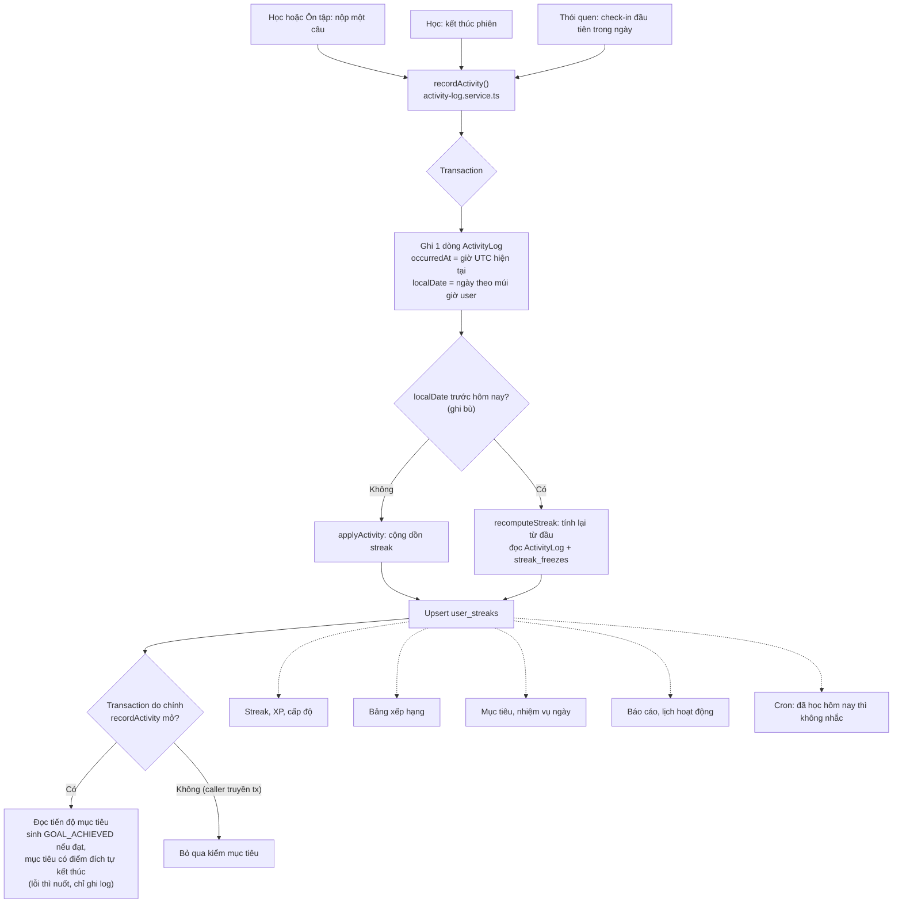
```mermaid
flowchart TD
    A["Học hoặc Ôn tập: nộp một câu"] --> F
    B["Học: kết thúc phiên"] --> F
    C["Thói quen: check-in đầu tiên trong ngày"] --> F
    F["recordActivity()<br/>activity-log.service.ts"] --> T{"Transaction"}
    T --> W["Ghi 1 dòng ActivityLog<br/>occurredAt = giờ UTC hiện tại<br/>localDate = ngày theo múi giờ user"]
    W --> D{"localDate trước hôm nay?<br/>(ghi bù)"}
    D -- "Không" --> U["applyActivity: cộng dồn streak"]
    D -- "Có" --> R["recomputeStreak: tính lại từ đầu<br/>đọc ActivityLog + streak_freezes"]
    U --> S["Upsert user_streaks"]
    R --> S
    S --> K{"Transaction do chính<br/>recordActivity mở?"}
    K -- "Có" --> G["Đọc tiến độ mục tiêu<br/>sinh GOAL_ACHIEVED nếu đạt,<br/>mục tiêu có điểm đích tự kết thúc<br/>(lỗi thì nuốt, chỉ ghi log)"]
    K -- "Không (caller truyền tx)" --> X["Bỏ qua kiểm mục tiêu"]

    S -.-> O1["Streak, XP, cấp độ"]
    S -.-> O2["Bảng xếp hạng"]
    S -.-> O3["Mục tiêu, nhiệm vụ ngày"]
    S -.-> O4["Báo cáo, lịch hoạt động"]
    S -.-> O5["Cron: đã học hôm nay thì không nhắc"]
```

Loại hoạt động ghi ra:

| Hành động | `ActivityType` | Ghi chú |
|---|---|---|
| Trả lời thẻ **chưa từng học** | `VOCAB_LEARNED` | Mỗi thẻ một dòng |
| Trả lời thẻ **đã có lịch ôn** | `FLASHCARD_REVIEWED` | Mỗi thẻ một dòng |
| Kết thúc phiên Học | `QUIZ_COMPLETED` | `dedupeKey = SESSION:<sessionKey>` |
| Check-in thói quen tự tích | `HABIT_CHECKIN` | Tối đa một dòng mỗi ngày (`dedupeKey = HABIT_CHECKIN:<ngày>`); có thể mang `localDate` quá khứ |

Ai truyền `tx`: trả lời thẻ (`study.submitAnswer`) và check-in thói quen (`habits.checkIn`) đều
truyền, vì phải ghi cùng transaction với tiến độ / bản ghi check-in. Chỉ kết thúc phiên Học
(`study.finishSession`) không truyền — nên đó là **đường duy nhất** hiện nay sinh `GOAL_ACHIEVED`
và tự kết thúc mục tiêu có điểm đích. "Lần ghi sau sẽ phát hiện" (chú thích trong code) không xảy
ra với hai đường kia.

Thói quen **tự động** không đi qua phễu này: nó không ghi gì, chỉ đọc lại `ActivityLog` do Học và
Ôn tập đã ghi.

### 4.2 Đăng nhập và duy trì phiên

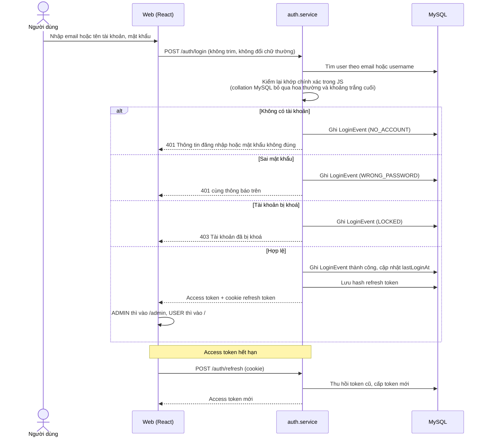
```mermaid
sequenceDiagram
    actor U as Người dùng
    participant FE as Web (React)
    participant BE as auth.service
    participant DB as MySQL

    U->>FE: Nhập email hoặc tên tài khoản, mật khẩu
    FE->>BE: POST /auth/login (không trim, không đổi chữ thường)
    BE->>DB: Tìm user theo email hoặc username
    BE->>BE: Kiểm lại khớp chính xác trong JS<br/>(collation MySQL bỏ qua hoa thường và khoảng trắng cuối)
    alt Không có tài khoản
        BE->>DB: Ghi LoginEvent (NO_ACCOUNT)
        BE-->>FE: 401 Thông tin đăng nhập hoặc mật khẩu không đúng
    else Sai mật khẩu
        BE->>DB: Ghi LoginEvent (WRONG_PASSWORD)
        BE-->>FE: 401 cùng thông báo trên
    else Tài khoản bị khoá
        BE->>DB: Ghi LoginEvent (LOCKED)
        BE-->>FE: 403 Tài khoản đã bị khoá
    else Hợp lệ
        BE->>DB: Ghi LoginEvent thành công, cập nhật lastLoginAt
        BE->>DB: Lưu hash refresh token
        BE-->>FE: Access token + cookie refresh token
        FE->>FE: ADMIN thì vào /admin, USER thì vào /
    end

    Note over FE,BE: Access token hết hạn
    FE->>BE: POST /auth/refresh (cookie)
    BE->>DB: Thu hồi token cũ, cấp token mới
    BE-->>FE: Access token mới
```

### 4.3 Quên mật khẩu — quản trị viên duyệt

Đặc tả đầy đủ và phần đánh đổi an toàn: `docs/luong-quen-mat-khau.md`.

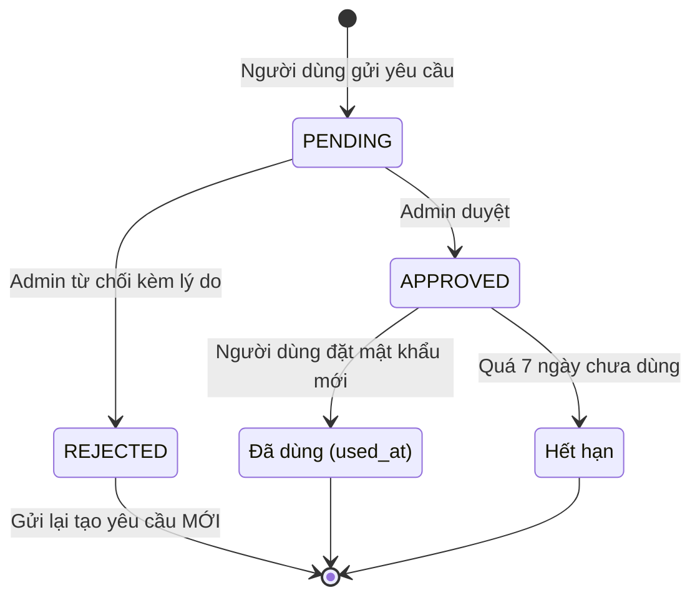
```mermaid
stateDiagram-v2
    state "Đã dùng (used_at)" as DaDung
    state "Hết hạn" as HetHan
    [*] --> PENDING: Người dùng gửi yêu cầu
    PENDING --> APPROVED: Admin duyệt
    PENDING --> REJECTED: Admin từ chối kèm lý do
    APPROVED --> DaDung: Người dùng đặt mật khẩu mới
    APPROVED --> HetHan: Quá 7 ngày chưa dùng
    REJECTED --> [*]: Gửi lại tạo yêu cầu MỚI
    DaDung --> [*]
    HetHan --> [*]
```

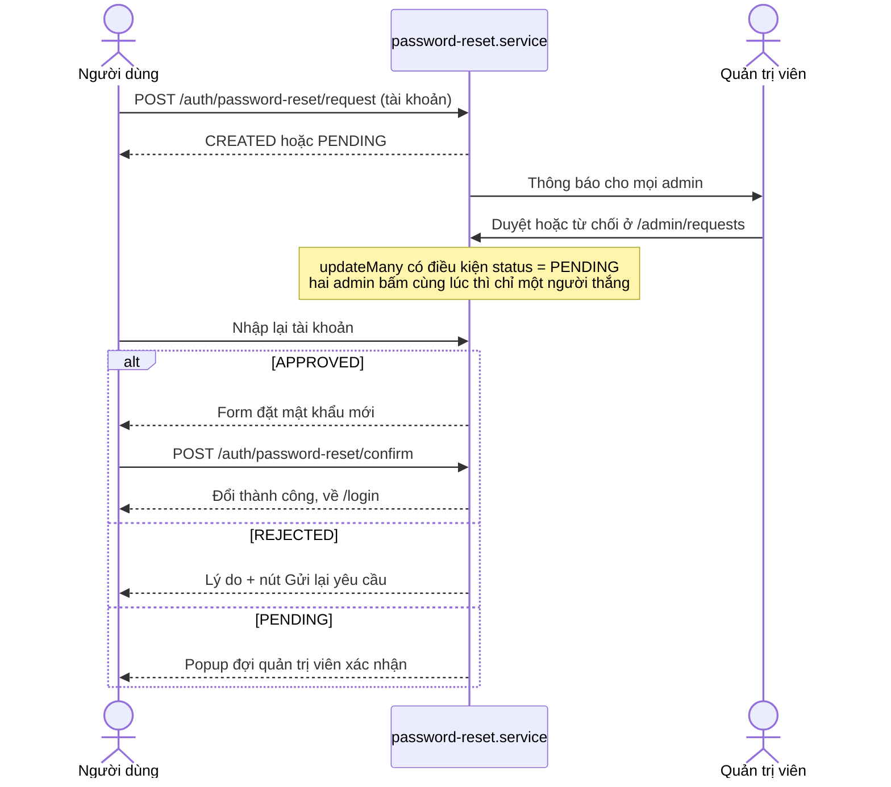
```mermaid
sequenceDiagram
    actor U as Người dùng
    participant BE as password-reset.service
    actor A as Quản trị viên

    U->>BE: POST /auth/password-reset/request (tài khoản)
    BE-->>U: CREATED hoặc PENDING
    BE->>A: Thông báo cho mọi admin
    A->>BE: Duyệt hoặc từ chối ở /admin/requests
    Note over BE: updateMany có điều kiện status = PENDING<br/>hai admin bấm cùng lúc thì chỉ một người thắng
    U->>BE: Nhập lại tài khoản
    alt APPROVED
        BE-->>U: Form đặt mật khẩu mới
        U->>BE: POST /auth/password-reset/confirm
        BE-->>U: Đổi thành công, về /login
    else REJECTED
        BE-->>U: Lý do + nút Gửi lại yêu cầu
    else PENDING
        BE-->>U: Popup đợi quản trị viên xác nhận
    end
```

### 4.4 Học và Ôn tập — phát đề, chấm, ghi

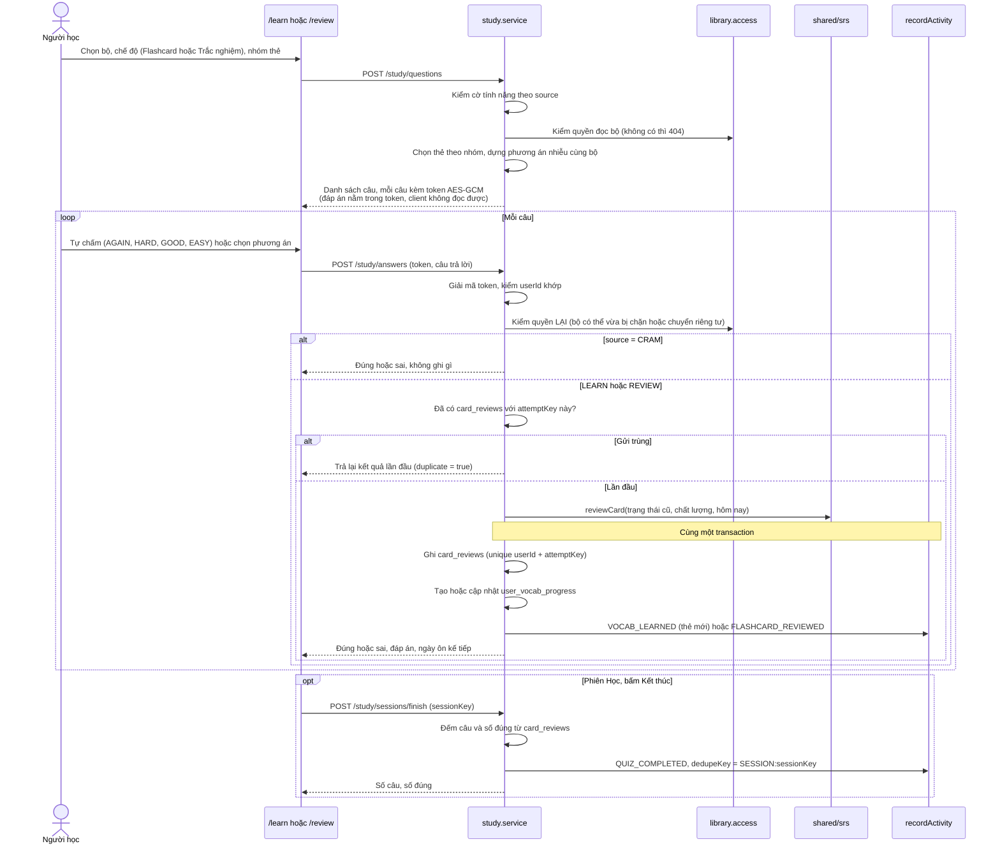
```mermaid
sequenceDiagram
    actor U as Người học
    participant FE as /learn hoặc /review
    participant ST as study.service
    participant AC as library.access
    participant SRS as shared/srs
    participant RA as recordActivity

    U->>FE: Chọn bộ, chế độ (Flashcard hoặc Trắc nghiệm), nhóm thẻ
    FE->>ST: POST /study/questions
    ST->>ST: Kiểm cờ tính năng theo source
    ST->>AC: Kiểm quyền đọc bộ (không có thì 404)
    ST->>ST: Chọn thẻ theo nhóm, dựng phương án nhiễu cùng bộ
    ST-->>FE: Danh sách câu, mỗi câu kèm token AES-GCM<br/>(đáp án nằm trong token, client không đọc được)

    loop Mỗi câu
        U->>FE: Tự chấm (AGAIN, HARD, GOOD, EASY) hoặc chọn phương án
        FE->>ST: POST /study/answers (token, câu trả lời)
        ST->>ST: Giải mã token, kiểm userId khớp
        ST->>AC: Kiểm quyền LẠI (bộ có thể vừa bị chặn hoặc chuyển riêng tư)
        alt source = CRAM
            ST-->>FE: Đúng hoặc sai, không ghi gì
        else LEARN hoặc REVIEW
            ST->>ST: Đã có card_reviews với attemptKey này?
            alt Gửi trùng
                ST-->>FE: Trả lại kết quả lần đầu (duplicate = true)
            else Lần đầu
                ST->>SRS: reviewCard(trạng thái cũ, chất lượng, hôm nay)
                Note over ST,RA: Cùng một transaction
                ST->>ST: Ghi card_reviews (unique userId + attemptKey)
                ST->>ST: Tạo hoặc cập nhật user_vocab_progress
                ST->>RA: VOCAB_LEARNED (thẻ mới) hoặc FLASHCARD_REVIEWED
                ST-->>FE: Đúng hoặc sai, đáp án, ngày ôn kế tiếp
            end
        end
    end

    opt Phiên Học, bấm Kết thúc
        FE->>ST: POST /study/sessions/finish (sessionKey)
        ST->>ST: Đếm câu và số đúng từ card_reviews
        ST->>RA: QUIZ_COMPLETED, dedupeKey = SESSION:sessionKey
        ST-->>FE: Số câu, số đúng
    end
```

### 4.5 Check-in thói quen

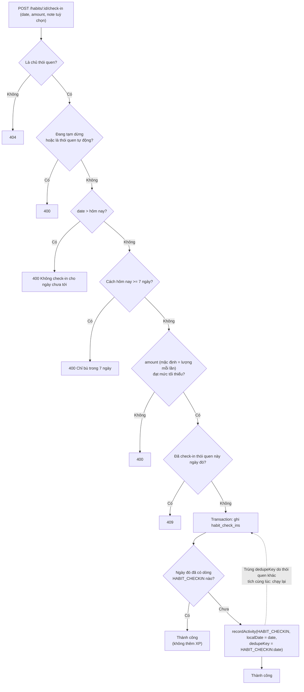
```mermaid
flowchart TD
    S["POST /habits/:id/check-in (date, amount, note tuỳ chọn)"] --> O{"Là chủ thói quen?"}
    O -- "Không" --> E1["404"]
    O -- "Có" --> P{"Đang tạm dừng<br/>hoặc là thói quen tự động?"}
    P -- "Có" --> E5["400"]
    P -- "Không" --> F{"date > hôm nay?"}
    F -- "Có" --> E2["400 Không check-in cho ngày chưa tới"]
    F -- "Không" --> B{"Cách hôm nay >= 7 ngày?"}
    B -- "Có" --> E3["400 Chỉ bù trong 7 ngày"]
    B -- "Không" --> M{"amount (mặc định = lượng mỗi lần)<br/>đạt mức tối thiểu?"}
    M -- "Không" --> E6["400"]
    M -- "Có" --> D{"Đã check-in thói quen này ngày đó?"}
    D -- "Có" --> E4["409"]
    D -- "Không" --> T["Transaction: ghi habit_check_ins"]
    T --> Q{"Ngày đó đã có dòng<br/>HABIT_CHECKIN nào?"}
    Q -- "Có" --> OK["Thành công<br/>(không thêm XP)"]
    Q -- "Chưa" --> R["recordActivity(HABIT_CHECKIN, localDate = date,<br/>dedupeKey = HABIT_CHECKIN:date)"]
    R --> OK2["Thành công"]
    R -.->|"Trùng dedupeKey do thói quen khác<br/>tích cùng lúc: chạy lại"| T
```

Trùng khoá `dedupe_key` (hai thói quen tích cùng lúc) làm transaction huỷ; service chạy lại một
lần, lúc đó thấy dòng của bên kia và bỏ qua bước ghi hoạt động.

### 4.6 Phần thưởng — điểm danh, nhiệm vụ, vật phẩm giữ chuỗi

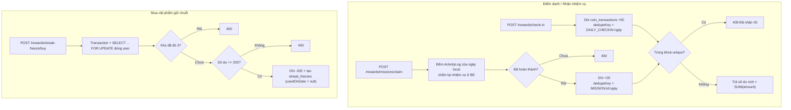
```mermaid
flowchart TD
    subgraph CK["Điểm danh / Nhận nhiệm vụ"]
        C1["POST /rewards/check-in"] --> C2["Ghi coin_transactions +50<br/>dedupeKey = DAILY_CHECKIN:ngày"]
        M1["POST /rewards/missions/claim"] --> M2["Đếm ActivityLog của ngày local<br/>chấm lại nhiệm vụ ở BE"]
        M2 --> M3{"Đã hoàn thành?"}
        M3 -- "Chưa" --> M4["400"]
        M3 -- "Rồi" --> M5["Ghi +20<br/>dedupeKey = MISSION:id:ngày"]
        C2 --> DUP{"Trùng khoá unique?"}
        M5 --> DUP
        DUP -- "Có" --> E409["409 Đã nhận rồi"]
        DUP -- "Không" --> OK1["Trả số dư mới = SUM(amount)"]
    end

    subgraph FZ["Mua vật phẩm giữ chuỗi"]
        B1["POST /rewards/streak-freeze/buy"] --> B2["Transaction + SELECT ... FOR UPDATE dòng user"]
        B2 --> B3{"Kho đã đủ 3?"}
        B3 -- "Rồi" --> B4["400"]
        B3 -- "Chưa" --> B5{"Số dư >= 200?"}
        B5 -- "Không" --> B6["400"]
        B5 -- "Có" --> B7["Ghi -200 + tạo streak_freezes (usedOnDate = null)"]
    end
```

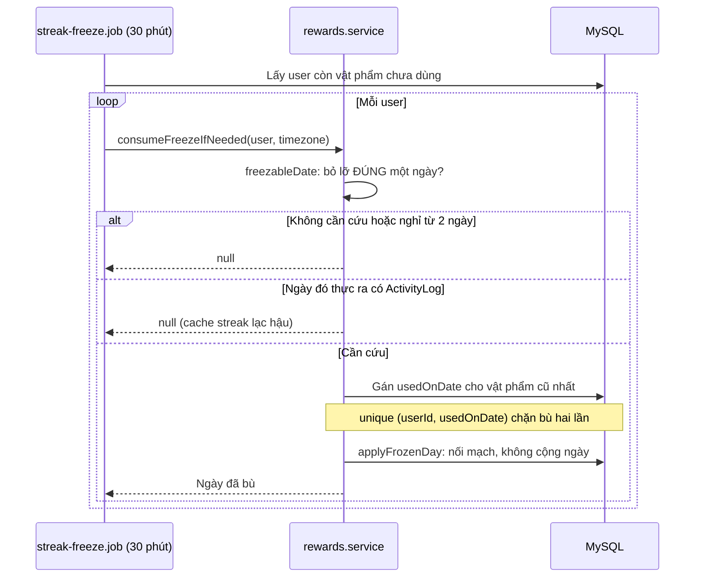
```mermaid
sequenceDiagram
    participant J as streak-freeze.job (30 phút)
    participant R as rewards.service
    participant DB as MySQL

    J->>DB: Lấy user còn vật phẩm chưa dùng
    loop Mỗi user
        J->>R: consumeFreezeIfNeeded(user, timezone)
        R->>R: freezableDate: bỏ lỡ ĐÚNG một ngày?
        alt Không cần cứu hoặc nghỉ từ 2 ngày
            R-->>J: null
        else Ngày đó thực ra có ActivityLog
            R-->>J: null (cache streak lạc hậu)
        else Cần cứu
            R->>DB: Gán usedOnDate cho vật phẩm cũ nhất
            Note over R,DB: unique (userId, usedOnDate) chặn bù hai lần
            R->>DB: applyFrozenDay: nối mạch, không cộng ngày
            R-->>J: Ngày đã bù
        end
    end
```

### 4.7 Mua vật phẩm cửa hàng

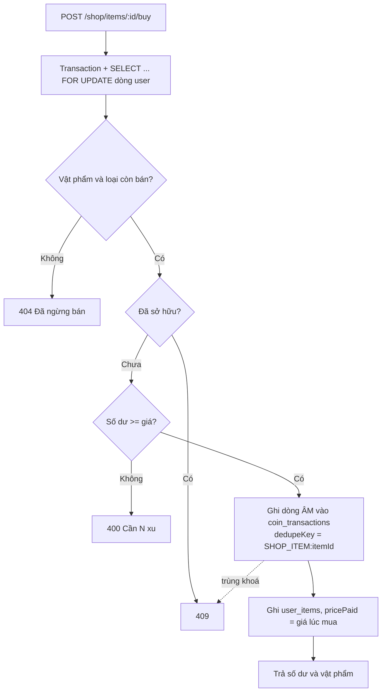
```mermaid
flowchart TD
    A["POST /shop/items/:id/buy"] --> L["Transaction + SELECT ... FOR UPDATE dòng user"]
    L --> I{"Vật phẩm và loại còn bán?"}
    I -- "Không" --> E1["404 Đã ngừng bán"]
    I -- "Có" --> O{"Đã sở hữu?"}
    O -- "Có" --> E2["409"]
    O -- "Chưa" --> C{"Số dư >= giá?"}
    C -- "Không" --> E3["400 Cần N xu"]
    C -- "Có" --> W["Ghi dòng ÂM vào coin_transactions<br/>dedupeKey = SHOP_ITEM:itemId"]
    W --> U["Ghi user_items, pricePaid = giá lúc mua"]
    U --> OK["Trả số dư và vật phẩm"]
    W -.->|"trùng khoá"| E2
```

Khoá dòng user là bắt buộc: hai lệnh mua **hai vật phẩm khác nhau** cùng lúc có hai
`dedupeKey` khác nhau, nên chỉ ràng buộc unique không chặn được việc tiêu âm số dư.

### 4.8 Vào nhóm lớp

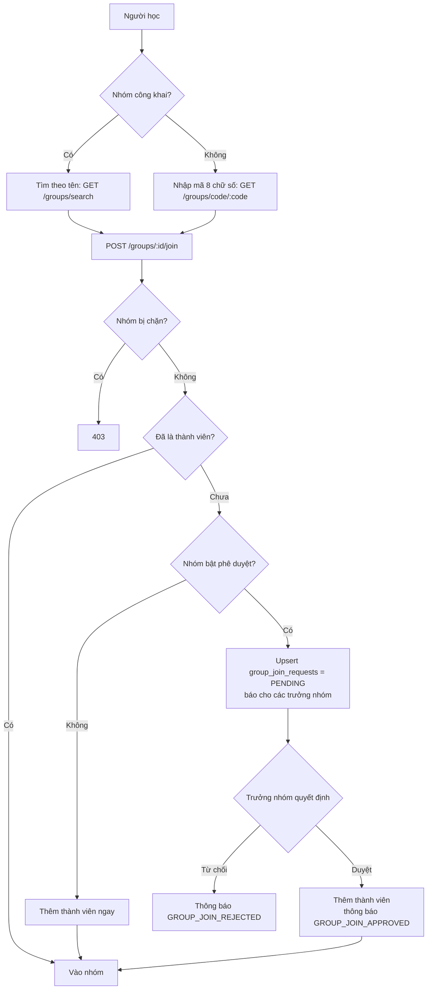
```mermaid
flowchart TD
    S["Người học"] --> T{"Nhóm công khai?"}
    T -- "Có" --> SR["Tìm theo tên: GET /groups/search"]
    T -- "Không" --> CD["Nhập mã 8 chữ số: GET /groups/code/:code"]
    SR --> J["POST /groups/:id/join"]
    CD --> J
    J --> BL{"Nhóm bị chặn?"}
    BL -- "Có" --> E1["403"]
    BL -- "Không" --> MB{"Đã là thành viên?"}
    MB -- "Có" --> IN["Vào nhóm"]
    MB -- "Chưa" --> AP{"Nhóm bật phê duyệt?"}
    AP -- "Không" --> ADD["Thêm thành viên ngay"] --> IN
    AP -- "Có" --> RQ["Upsert group_join_requests = PENDING<br/>báo cho các trưởng nhóm"]
    RQ --> LD{"Trưởng nhóm quyết định"}
    LD -- "Duyệt" --> ADD2["Thêm thành viên<br/>thông báo GROUP_JOIN_APPROVED"] --> IN
    LD -- "Từ chối" --> REJ["Thông báo GROUP_JOIN_REJECTED"]
```

### 4.9 Đăng bài có đề cập trong nhóm

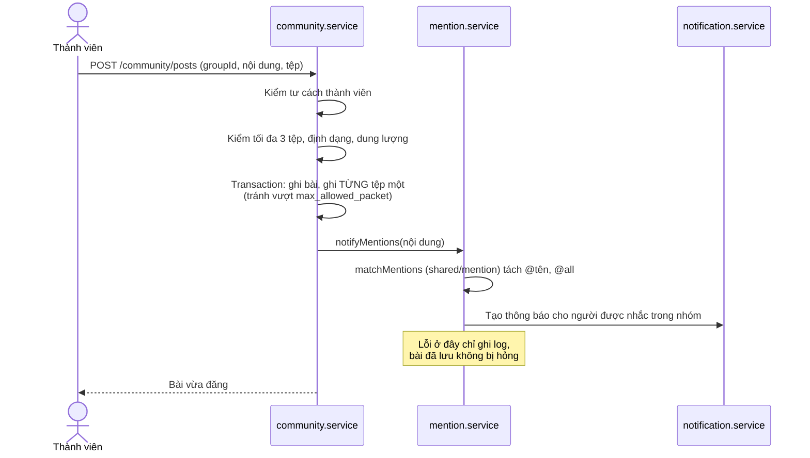
```mermaid
sequenceDiagram
    actor U as Thành viên
    participant CS as community.service
    participant MS as mention.service
    participant NS as notification.service

    U->>CS: POST /community/posts (groupId, nội dung, tệp)
    CS->>CS: Kiểm tư cách thành viên
    CS->>CS: Kiểm tối đa 3 tệp, định dạng, dung lượng
    CS->>CS: Transaction: ghi bài, ghi TỪNG tệp một<br/>(tránh vượt max_allowed_packet)
    CS->>MS: notifyMentions(nội dung)
    MS->>MS: matchMentions (shared/mention) tách @tên, @all
    MS->>NS: Tạo thông báo cho người được nhắc trong nhóm
    Note over MS: Lỗi ở đây chỉ ghi log,<br/>bài đã lưu không bị hỏng
    CS-->>U: Bài vừa đăng
```

### 4.10 Báo cáo và kiểm duyệt bộ thẻ

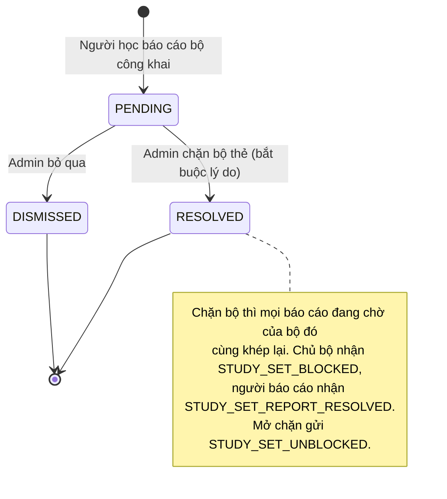
```mermaid
stateDiagram-v2
    [*] --> PENDING: Người học báo cáo bộ công khai
    PENDING --> RESOLVED: Admin chặn bộ thẻ (bắt buộc lý do)
    PENDING --> DISMISSED: Admin bỏ qua
    RESOLVED --> [*]
    DISMISSED --> [*]

    note right of RESOLVED
        Chặn bộ thì mọi báo cáo đang chờ của bộ đó
        cùng khép lại. Chủ bộ nhận STUDY_SET_BLOCKED,
        người báo cáo nhận STUDY_SET_REPORT_RESOLVED.
        Mở chặn gửi STUDY_SET_UNBLOCKED.
    end note
```

Bộ bị chặn biến khỏi `readableSetWhere` của **mọi người trừ chủ**, nên Học, Ôn tập, lịch sử,
số thẻ tới hạn và cron nhắc nhở đều tự bỏ qua thẻ của bộ đó mà không cần sửa từng chỗ.

### 4.11 Cron nhắc nhở học tập

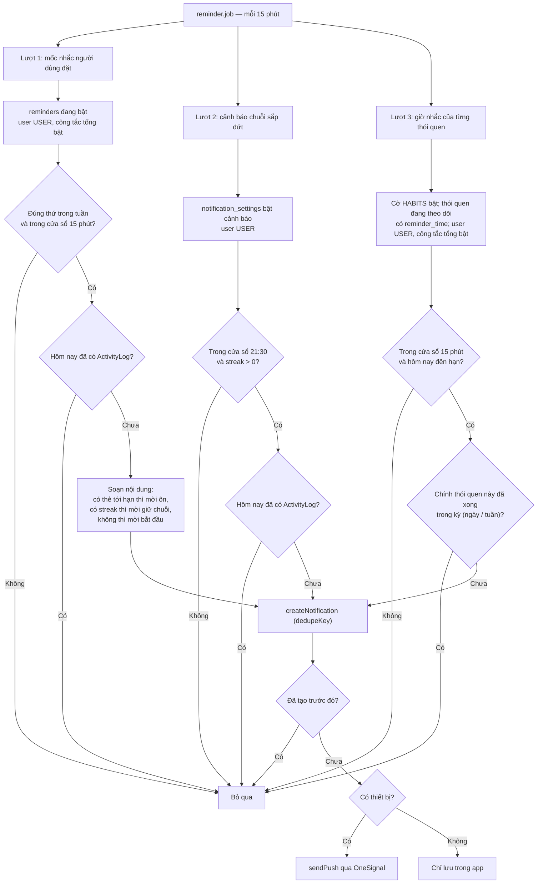
```mermaid
flowchart TD
    T["reminder.job — mỗi 15 phút"] --> P1["Lượt 1: mốc nhắc người dùng đặt"]
    T --> P2["Lượt 2: cảnh báo chuỗi sắp đứt"]
    T --> P3["Lượt 3: giờ nhắc của từng thói quen"]

    P1 --> Q1["reminders đang bật<br/>user USER, công tắc tổng bật"]
    Q1 --> W1{"Đúng thứ trong tuần<br/>và trong cửa sổ 15 phút?"}
    W1 -- "Không" --> SK["Bỏ qua"]
    W1 -- "Có" --> H1{"Hôm nay đã có ActivityLog?"}
    H1 -- "Có" --> SK
    H1 -- "Chưa" --> BD["Soạn nội dung:<br/>có thẻ tới hạn thì mời ôn,<br/>có streak thì mời giữ chuỗi,<br/>không thì mời bắt đầu"]
    BD --> DL

    P2 --> Q2["notification_settings bật cảnh báo<br/>user USER"]
    Q2 --> W2{"Trong cửa sổ 21:30<br/>và streak > 0?"}
    W2 -- "Không" --> SK
    W2 -- "Có" --> H2{"Hôm nay đã có ActivityLog?"}
    H2 -- "Có" --> SK
    H2 -- "Chưa" --> DL

    P3 --> Q3["Cờ HABITS bật; thói quen đang theo dõi<br/>có reminder_time; user USER, công tắc tổng bật"]
    Q3 --> W3{"Trong cửa sổ 15 phút<br/>và hôm nay đến hạn?"}
    W3 -- "Không" --> SK
    W3 -- "Có" --> H3{"Chính thói quen này đã xong<br/>trong kỳ (ngày / tuần)?"}
    H3 -- "Có" --> SK
    H3 -- "Chưa" --> DL

    DL["createNotification (dedupeKey)"] --> DD{"Đã tạo trước đó?"}
    DD -- "Có" --> SK
    DD -- "Chưa" --> PU{"Có thiết bị?"}
    PU -- "Có" --> OS["sendPush qua OneSignal"]
    PU -- "Không" --> END1["Chỉ lưu trong app"]
```

Khoá chống trùng: `DAILY_REMINDER:<reminderId>:<ngày>`, `STREAK_AT_RISK:<ngày>` và
`DAILY_REMINDER:HABIT-<habitId>:<ngày>`. Lượt 3 khác hai lượt đầu ở điều kiện im lặng: người đã học
trong app vẫn được nhắc thói quen họ tự đặt giờ nếu thói quen đó chưa xong. Thông báo **luôn lưu
DB trước**, push chỉ là kênh báo thêm.

### 4.12 Bật, tắt tính năng

```mermaid
sequenceDiagram
    actor A as Quản trị viên
    participant FF as feature.service
    participant G as requireFeature (app.ts)
    participant FE as Web người học

    A->>FF: PATCH /admin/features/:key (bật hoặc tắt)
    FF->>FF: Ghi feature_flags, xoá cache
    FE->>FF: GET /features
    FF-->>FE: Trạng thái các cờ
    FE->>FE: Ẩn mục sidebar, route bị tắt ra 404
    FE->>G: Gọi thẳng API của tính năng đã tắt
    G-->>FE: 404 (không phải 403)
    Note over FF: Thiếu dòng trong feature_flags nghĩa là BẬT.<br/>Tắt không xoá dữ liệu, bật lại là thấy đúng chỗ đang dở.
```

### 4.13 Khoá tài khoản

```mermaid
flowchart TD
    A["PATCH /admin/users/:id/status = LOCKED"] --> S{"Là chính mình?"}
    S -- "Có" --> E1["400"]
    S -- "Không" --> L{"Là admin hoạt động cuối cùng?"}
    L -- "Có" --> E2["400"]
    L -- "Không" --> U["Đặt status = LOCKED"]
    U --> R["Thu hồi mọi refresh token<br/>+ ghi nhật ký thao tác USER_LOCKED"]
    R --> X["Lần refresh kế tiếp thất bại,<br/>đăng nhập lại nhận 403 Tài khoản đã bị khoá"]
```

---

## 5. Ma trận quyền và cờ tính năng

| Phân hệ | Khách | Người học | Quản trị viên | Cờ tính năng |
|---|---|---|---|---|
| Đăng ký, đăng nhập, quên mật khẩu | ✔ | — | — | Không có cờ |
| Hồ sơ, đổi mật khẩu | — | ✔ | ✔ | Không có cờ |
| Thông báo trong app | — | ✔ | ✔ | Không có cờ |
| Cấu hình nhắc nhở | — | ✔ | ✘ | Không có cờ |
| Tổng quan `/` | — | ✔ | ✘ | Không có cờ |
| Thư viện | — | ✔ | ✘ | `VOCABULARY` |
| Học | — | ✔ | ✘ | `LEARN` (phụ thuộc `VOCABULARY`) |
| Ôn tập, Cram | — | ✔ | ✘ | `FLASHCARDS` (phụ thuộc `VOCABULARY`) |
| Thói quen | — | ✔ | ✘ | `HABITS` |
| Việc cần làm | — | ✔ | ✘ | `TODO` |
| Mục tiêu | — | ✔ | ✘ | `GOALS` |
| Báo cáo | — | ✔ | ✘ | `REPORT` |
| Bảng xếp hạng | — | ✔ | ✘ | `LEADERBOARD` |
| Phần thưởng | — | ✔ | ✘ | `REWARDS` |
| Cửa hàng, Ví, Kho | — | ✔ | ✘ | `SHOP` |
| Cộng đồng | — | ✔ | ✔ kiểm duyệt | `COMMUNITY` (admin bỏ qua cờ) |
| Nhóm lớp | — | ✔ | ✘ (dùng `/admin/groups`) | `GROUPS` |
| `/topics` (đọc bộ Hệ thống) | — | ✘ | ✔ | Không có cờ |
| Khu `/admin/*` | — | ✘ | ✔ | Không có cờ |

✔ được dùng · ✘ bị chặn ở backend · — không áp dụng

---

## 6. Bất biến toàn hệ thống

Những điều **mọi luồng** trên cùng tuân theo. Vi phạm một điều thường không báo lỗi ngay mà
làm số liệu sai lệch dần.

| # | Bất biến | Cài ở đâu |
|---|---|---|
| 1 | `ActivityLog` là nguồn sự thật duy nhất của hoạt động học; chỉ `recordActivity` được ghi | `activity-log.service.ts` |
| 2 | `user_streaks` là cache, luôn tái tạo được từ `ActivityLog` + `streak_freezes` | `recomputeStreak`, script `recompute-streak` |
| 3 | Mọi phép tính ngày dùng `local_date` theo múi giờ user, không đổi múi giờ trong SQL | Cột `local_date`, `toLocalDate` |
| 4 | Số dư xu = `SUM(amount)` của `coin_transactions`; không có cột số dư | `getCoinBalance` |
| 5 | Chống trùng bằng ràng buộc unique của DB, không bằng đọc-rồi-ghi | `dedupeKey`, `attemptKey`, `pendingKey`, `usedOnDate` |
| 6 | Trừ xu nằm trong transaction có khoá dòng user | `buyItem`, `buyStreakFreeze` |
| 7 | Phần thưởng, mua hàng, việc cần làm, bài đăng và Cram không ghi `ActivityLog`, không cộng XP | `rewards`, `shop`, `todos`, `community`, `study` (nguồn `CRAM`) |
| 8 | Quyền đọc bộ thẻ tính ở đúng một chỗ, không có quyền thì 404 | `readableSetWhere` |
| 9 | Đáp án không rời server trước khi trả lời | Token AES-GCM, `question-token.ts` |
| 10 | Thông báo lưu DB trước, push sau; mọi thông báo tự động có `dedupeKey` | `notification.service`, `reminder.job` |
| 11 | Lịch gửi thông báo chỉ do `be/src/jobs` quyết định | `reminder.job.ts` |
| 12 | Nhóm luôn còn ít nhất một trưởng nhóm | `assertNotLastLeader` |
| 13 | Bài nhóm không bao giờ lọt ra bảng tin chung | `groupId: query.groupId ?? null` |
| 14 | Hệ thống luôn còn ít nhất một quản trị viên hoạt động | `admin.service.ts` |
| 15 | Tắt tính năng là đảo ngược được, không xoá dữ liệu | `feature.service`, `requireFeature` |
