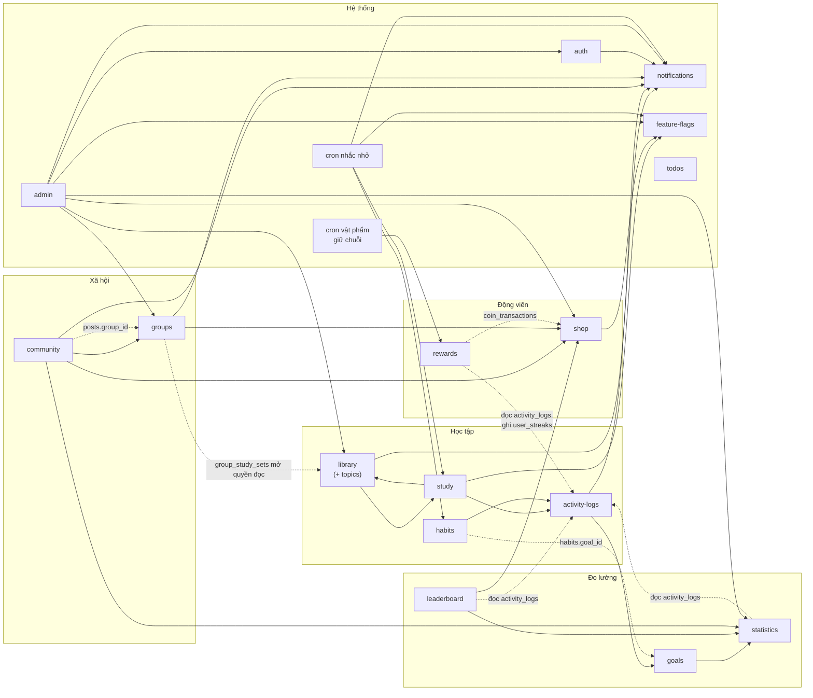

# Logic nghiệp vụ theo module

> Mỗi tệp trong thư mục này mô tả **một module chức năng** của ENG//HABIT: nó hoạt động ra sao,
> dữ liệu của nó ảnh hưởng tới module nào, và nó liên kết với module nào.
>
> **Nguồn:** rà soát mã nguồn ngày 21/09/2026 (commit `d41342b`) — 17 thư mục module ở
> `be/src/modules`, 2 cron ở `be/src/jobs`, `shared/src`, `fe/src/routes/AppRoutes.tsx`. Mọi con
> số (giá xu, ngưỡng, giới hạn) lấy từ code. Cập nhật 22/09/2026 theo commit `47d14b1`: mục tiêu
> và thói quen (`goals.md`, `habits.md` viết lại), đăng nhập so khớp chính xác (`auth.md`), nhật ký
> thao tác và màn Nội dung học tập (`admin.md`, `library.md`), lượt nhắc thói quen
> (`notifications.md`).
>
> Tài liệu liên quan: `docs/phan-tich-do-an.md` (mô tả tổng thể hệ thống),
> `docs/chuc-nang-va-luong-nghiep-vu.md` (danh mục chức năng, sơ đồ use case và luồng),
> `docs/architecture.md` (vì sao kiến trúc như hiện tại).

## Cách đọc một tệp

Mọi tệp cùng khung bảy mục:

1. **Vai trò** — module giải quyết việc gì.
2. **Dữ liệu** — bảng module ghi, bảng của module khác nó đọc.
3. **Chức năng và cách hoạt động** — từng endpoint / tiến trình, các bước xử lý, quy tắc và hằng số.
4. **Liên kết với module khác** — gọi đi, được gọi, đọc chung bảng.
5. **Ảnh hưởng dây chuyền** — một thao tác ở đây làm đổi gì ở chỗ khác.
6. **Quy tắc bắt buộc giữ khi sửa**.
7. **Điểm cần lưu ý** — hạn chế và điều phát hiện khi rà soát.

## Danh mục

| Module | Tệp | Một dòng | Cờ tính năng | Ai dùng |
| --- | --- | --- | --- | --- |
| `activity-logs` | [activity-logs.md](activity-logs.md) | Nguồn sự thật của mọi hoạt động học, cập nhật chuỗi ngày | — | (nội bộ) |
| `auth` | [auth.md](auth.md) | Tài khoản, phiên, hồ sơ, quên mật khẩu | — | Khách, cả hai vai trò |
| `library` (+ `topics`) | [library.md](library.md) | Bộ thẻ, thẻ, quyền đọc, báo cáo vi phạm; bộ Hệ thống | `VOCABULARY` | Người học; admin soạn bộ Hệ thống |
| `study` | [study.md](study.md) | Học, Ôn tập, Cram — chấm theo SM-2 | `VOCABULARY` + `LEARN` / `FLASHCARDS` | Người học |
| `habits` | [habits.md](habits.md) | Thói quen tự tích (check-in, một dòng hoạt động mỗi ngày) và tự động (chấm từ hoạt động học); nhắc theo giờ | `HABITS` | Người học, cron |
| `goals` | [goals.md](goals.md) | Mục tiêu ngày / tuần / cộng dồn tới hạn; tiến độ và dự báo tính từ hoạt động; kết thúc, tạm dừng | `GOALS` | Người học |
| `todos` | [todos.md](todos.md) | Việc cần làm trong ngày (không ghi hoạt động) | `TODO` | Người học |
| `statistics` | [statistics.md](statistics.md) | Tổng quan, chuỗi, XP/cấp độ, lịch, Báo cáo | `REPORT` (chỉ báo cáo) | Người học |
| `leaderboard` | [leaderboard.md](leaderboard.md) | Xếp hạng theo XP hoặc số hoạt động | `LEADERBOARD` | Người học |
| `rewards` | [rewards.md](rewards.md) | Điểm danh, nhiệm vụ ngày, vật phẩm giữ chuỗi | `REWARDS` | Người học, cron |
| `shop` | [shop.md](shop.md) | Cửa hàng, ví, kho, khung viền ảnh đại diện | `SHOP` | Người học; admin soạn danh mục |
| `community` | [community.md](community.md) | Diễn đàn, bảng tin nhóm, tệp đính kèm, đề cập | `COMMUNITY` (admin bỏ qua) | Cả hai vai trò |
| `groups` | [groups.md](groups.md) | Nhóm lớp, thành viên, tài liệu, bộ thẻ chia sẻ | `GROUPS` | Người học (trưởng nhóm / thành viên) |
| `notifications` (+ cron) | [notifications.md](notifications.md) | Sinh và lưu thông báo, cấu hình nhắc, cron nhắc học | — | Cả hai vai trò, cron |
| `feature-flags` | [feature-flags.md](feature-flags.md) | Bật/tắt tính năng người học | — | Admin; cắt ngang mọi module học |
| `admin` | [admin.md](admin.md) | Khu quản trị, điều phối service của module khác; nhật ký thao tác | — | Quản trị viên |

## Bản đồ phụ thuộc giữa các module

Mũi tên `A --> B` nghĩa là **code của A gọi hàm của B**. Nét đứt là **đọc / ghi chung bảng** mà
không gọi hàm.

`todos` đứng riêng: không gọi ai, không ai gọi nó. Nhật ký thao tác không vẽ vào sơ đồ cho đỡ rối:
`auth`, `topics`, `notifications`, `feature-flags`, `community` cùng gọi
`admin-audit.recordAdminAction` (xem trục thứ sáu bên dưới).

## Sáu "trục" dữ liệu dùng chung

Phần lớn liên kết giữa các module không đi qua lời gọi hàm mà qua **một chỗ dùng chung**. Sửa một
trục là sửa hành vi của mọi module bám vào nó.

| Trục | Nơi định nghĩa | Ai ghi | Ai đọc |
| --- | --- | --- | --- |
| **`activity_logs`** — nguồn sự thật của hoạt động học | `activity-log.service.recordActivity` | `study`, `habits` (qua `recordActivity`) | `statistics`, `goals`, `habits` (thói quen tự động), `leaderboard`, `rewards`, `feature-flags`, `admin`, `groups`, cron nhắc nhở, cron vật phẩm |
| **`coin_transactions`** — sổ cái xu | `rewards.service`, `shop.service` | `rewards` (thu, mua vật phẩm giữ chuỗi), `shop` (mua) | `rewards`, `shop` |
| **`notifications`** — hộp thông báo | `notification.service.createNotification` | `activity-logs`, `auth`, `library`, `groups`, `community`, `admin`, cron nhắc nhở | Người dùng (chuông, `/notifications`) |
| **Quyền đọc bộ thẻ** | `library.access.readableSetWhere` | — | `library`, `study`, cron nhắc nhở (qua `study.countDueCards`); nhánh 3 đọc bảng của `groups` |
| **Cờ tính năng** | `shared/constants/features.ts` + `feature_flags` | `admin` | Guard ở `app.ts`, `study`, `shop.frame`, cron nhắc nhở, FE |
| **`admin_audit_logs`** — nhật ký thao tác của quản trị viên | `admin-audit.service.recordAdminAction` | `admin`, `topics`, `auth` (duyệt yêu cầu), `notifications` (gửi thông báo), `feature-flags`, `community` (xoá của người khác) | Tab Nhật ký của từng màn quản lý |

Hai điểm chung nhỏ hơn: `shop.frame.getEquippedFrameUrls` (khung viền, dùng ở `community`,
`leaderboard`, `groups`, `admin`) và `statistics.getLevelsFor` (cấp độ, dùng ở `community`,
`leaderboard`).

## Ma trận tác động — "làm việc X thì ảnh hưởng tới đâu"

| Hành động | Chuỗi ngày | XP / cấp / hạng | Mục tiêu | Nhiệm vụ ngày | Xu | Thẻ cần ôn | Nhắc nhở hôm nay | Thông báo sinh ra |
| --- | --- | --- | --- | --- | --- | --- | --- | --- |
| Trả lời thẻ ở Học / Ôn tập | ✔ | ✔ | ✔ | ✔ | — | ✔ | tắt | — |
| Kết thúc phiên Học | ✔ | ✔ (+20) | ✔ (mục tiêu có điểm đích tự kết thúc) | — | — | — | tắt | `GOAL_ACHIEVED` (nếu đạt) |
| Luyện Cram | — | — | — | — | — | — | — | — |
| Check-in thói quen — lần đầu trong ngày | ✔ | ✔ (+12) | ✔ | ✔ | — | — | tắt | — |
| Check-in thói quen — lần sau trong cùng ngày | — | — | — | — | — | — | — | — |
| Check-in bù (ngày chưa có check-in) | ✔ (dựng lại) | ✔ | ✔ (ngày được bù) | ✔ (ngày được bù) | — | — | — | — |
| Điểm danh / nhận nhiệm vụ | — | — | — | — | ✔ (+) | — | — | — |
| Mua vật phẩm giữ chuỗi | — | — | — | — | ✔ (−200) | — | — | — |
| Cron tiêu vật phẩm | ✔ (giữ) | — | — | — | — | — | — | — |
| Mua vật phẩm cửa hàng | — | — | — | — | ✔ (−) | — | — | — |
| Thêm / xong việc cần làm | — | — | — | — | — | — | — | — |
| Đăng bài / bình luận nhóm | — | — | — | — | — | — | — | `MENTIONED` |
| Chuyển bộ thẻ riêng tư / bị chặn | — | — | — | — | — | ✔ (người khác) | ✔ (người khác) | `STUDY_SET_BLOCKED` (nếu chặn) |
| Xoá bộ thẻ / thẻ | — | — | — | — | — | ✔ | ✔ | — |
| Khoá tài khoản | — | rời bảng | — | — | — | — | — | — |
| Tắt tính năng | — | — | — | — | — | có thể | có thể | — |

"Nhắc nhở hôm nay: tắt" nghĩa là hoạt động đầu tiên trong ngày làm cron nhắc nhở và cảnh báo chuỗi
im lặng tới hết ngày local. Lời nhắc theo giờ của **từng thói quen** thì chỉ im khi chính thói quen
đó đã xong trong kỳ.

Mọi thao tác ghi của quản trị viên (đổi vai trò, khoá, chặn, sửa nội dung, bật/tắt tính năng…)
thêm một dòng `admin_audit_logs`, ngoài các ảnh hưởng mô tả trong `admin.md`.

## Phát hiện khi rà soát (21/09/2026)

Những điểm mã nguồn lệch với ý định thiết kế hoặc với quy ước trong `CLAUDE.md`. Ghi lại để quyết
định; cột Mức ghi "Đã sửa" khi đã xử lý.

| # | Mức | Phát hiện | Tệp |
| --- | --- | --- | --- |
| 1 | Cao | Thông báo `GOAL_ACHIEVED` chỉ bắn khi **kết thúc phiên Học**; người chỉ dùng Ôn tập hoặc Thói quen không bao giờ nhận, vì hai đường đó truyền `tx` vào `recordActivity`. Từ 22/09 kéo theo cả việc mục tiêu chuỗi / cộng dồn không tự chuyển `COMPLETED` với những người này | `activity-logs.md` |
| 2 | Đã sửa (22/09) | ~~`habits.reminder_time` không cron nào đọc~~ — cron nhắc nhở có lượt 3 gửi lời nhắc theo giờ của từng thói quen | `habits.md`, `notifications.md` |
| 3 | Trung bình | Cảnh báo chuỗi sắp đứt và lời nhắc hằng ngày đọc cache `current_streak`, không qua `displayStreak` → người đã đứt chuỗi vẫn nhận "Chuỗi N ngày sắp đứt" | `notifications.md` |
| 4 | Trung bình | Backend `/groups/*` không có `requireRole(USER)` — token quản trị gọi thẳng API vẫn tạo / vào nhóm được | `groups.md` |
| 5 | Trung bình | Trưởng nhóm **xoá được nhóm đang bị chặn**; vẫn thêm / xoá thành viên, duyệt yêu cầu khi nhóm bị chặn | `groups.md` |
| 6 | Thấp | Bảng xếp hạng, danh sách thành viên nhóm, trang quản trị hiện chuỗi từ cache, có thể là chuỗi đã đứt | `leaderboard.md`, `groups.md`, `admin.md` |
| 7 | Thấp | Cảnh báo chuỗi luôn trỏ `/learn` kể cả khi cờ `LEARN` tắt | `notifications.md` |
| 8 | Thấp | Sau khi học / check-in, FE không làm mới cache `rewards` và `goals` → thanh nhiệm vụ và mục tiêu trễ tới lần tải lại | `study.md`, `habits.md` |
| 9 | Thấp | Dữ liệu và mã thừa: `notification_settings.last_sent_date` ghi mà không ai đọc; `REVIEW_DUE` không ai sinh (ngoài `MISTAKES_PENDING` đã biết); hằng `MAX_FLASHCARDS_PER_SESSION` không dùng; thư mục rỗng `fe/src/features/flashcards/`, `fe/src/features/vocabulary/` | `notifications.md`, `study.md` |
| 10 | Thấp | `getCoinBalance` có hai bản giống hệt ở `rewards` và `shop` | `shop.md` |
| 11 | Thấp | Trang Báo cáo vẫn chấm mục tiêu trong những ngày nó **tạm dừng** (`findGoalsOverlapping` không đọc `paused_at`) — quãng dừng kéo tỷ lệ đạt xuống | `goals.md` |
| 12 | Thấp | Tắt `HABITS` vẫn để nhiệm vụ `DO_HABIT` hiện ra dù không làm được; thói quen tự động cũng không làm được nhiệm vụ này | `habits.md`, `rewards.md` |

Tài liệu cũ chưa cập nhật theo đợt rà soát này: `docs/phu-luc-erd.md` (còn 23 bảng, hiện là 38),
`docs/phu-luc-api.md` (tiêu đề còn ghi 76 endpoint, còn nhóm `/flashcards`, `/lessons` đã gỡ; hiện là
157 route kể cả `/health`), `docs/ban-do-man-hinh.md` (khảo sát 12/09), bộ `docs/use-case/` (chưa có
Việc cần làm; sinh bằng script ngoài repo).
