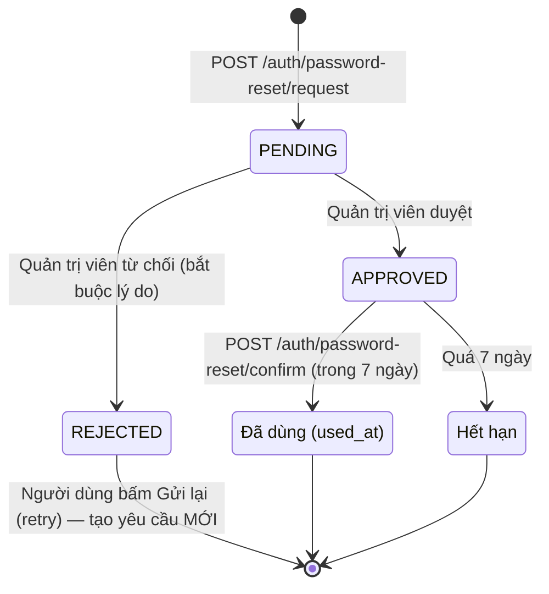

# Module `auth` — Tài khoản, phiên đăng nhập, quên mật khẩu

> **Mã nguồn:** `be/src/modules/auth/` (`auth.service.ts`, `token.service.ts`,
> `password-reset.service.ts`), `shared/src/schemas/auth.schema.ts`,
> `shared/src/schemas/password-reset.schema.ts`, `shared/src/avatar/`
> **Màn hình:** `/login`, `/register`, `/forgot-password`, `/profile`
> **Cờ tính năng:** không có (cố ý — tắt được là tự khoá cửa)
> **Quyền:** đăng ký, đăng nhập, quên mật khẩu mở cho khách; hồ sơ mở cho **cả hai vai trò**
> **Đặc tả chi tiết:** `docs/luong-quen-mat-khau.md`

## 1. Vai trò

Quản lý danh tính người dùng: tạo tài khoản, xác thực, duy trì phiên, hồ sơ cá nhân và luồng
cấp lại mật khẩu có quản trị viên duyệt. Mọi module khác dựa vào `req.user = {id, role,
timezone}` mà module này đặt vào access token.

## 2. Dữ liệu

| Bảng | Quyền | Ghi chú |
| --- | --- | --- |
| `users` | Ghi | `email` và `username` đều unique; `name` là tên hiển thị, được trùng. `timezone` IANA, mặc định `Asia/Ho_Chi_Minh` |
| `user_avatars` | Ghi | Ảnh đại diện dạng blob, quan hệ 1-1 |
| `refresh_tokens` | Ghi | Chỉ lưu **SHA-256** của token |
| `login_events` | Ghi | Mọi lượt đăng nhập, cả thất bại |
| `password_reset_requests` | Ghi | Nguồn sự thật của cả hai tab ở màn Quản lý yêu cầu |
| `user_streaks`, `notification_settings`, `reminders` | Tạo lúc đăng ký | Khởi tạo sẵn để module khác không phải kiểm tra null |

## 3. Chức năng và cách hoạt động

### 3.1 Đăng ký — `POST /auth/register`

1. Validate bằng `registerSchema`: tên 2–100 ký tự, tên tài khoản theo `usernameSchema`, email
   hợp lệ (tự chuyển chữ thường), mật khẩu 8–72 ký tự có cả chữ và số.
2. Kiểm tra trùng email **hoặc** tên tài khoản để báo đúng trường bị trùng. Ưu tiên báo trùng
   tên tài khoản.
3. Tạo `users` (bcrypt 10 vòng) và **cùng lúc** tạo `user_streaks`, `notification_settings`
   và một mốc nhắc `20:00` cả 7 ngày.
4. Hai người đăng ký cùng lúc: ràng buộc unique của DB chặn thật, lỗi `P2002` được đổi thành
   409 với đúng tên trường.
5. Cấp phiên (mục 3.3) và trả về người dùng.

### 3.2 Đăng nhập — `POST /auth/login`

1. Nhận `identifier` là **email hoặc tên tài khoản** (`findByIdentifier` tra `OR` hai cột).
   `loginSchema` **không** trim, không đổi chữ thường — chỉ chặn chuỗi toàn khoảng trắng.
   So khớp **chính xác**: tên tài khoản phân biệt hoa thường và khoảng trắng (`user` ≠ `User` ≠
   `"  user  "`); email không phân biệt hoa thường (lưu chữ thường lúc đăng ký) nhưng không được
   thừa khoảng trắng. Kết quả DB được **kiểm lại trong JS**: collation `utf8mb4_unicode_ci` không
   phân biệt hoa thường và là loại PAD SPACE (bỏ qua khoảng trắng cuối), nên `username = 'User  '`
   vẫn khớp dòng `user` nếu chỉ tin DB.
2. Không có tài khoản → ghi `LoginEvent(NO_ACCOUNT)`, trả 401.
3. Sai mật khẩu → ghi `LoginEvent(WRONG_PASSWORD)`, trả 401 **cùng thông báo** với bước 2 để
   không lộ tài khoản nào tồn tại.
4. Tài khoản `LOCKED` → ghi `LoginEvent(LOCKED)`, trả 403 kèm lý do rõ ràng (mật khẩu đã đúng
   nên không lộ thêm gì).
5. Thành công → ghi `LoginEvent(success)` và cập nhật `users.last_login_at` song song, cấp phiên.
6. FE điều hướng: `ADMIN` vào `/admin`, `USER` vào `/`.

Nhật ký ghi **email thật** khi lần ra tài khoản, ghi nguyên chuỗi người dùng gõ khi không lần ra.

### 3.3 Phiên đăng nhập — `token.service.ts`

| Thành phần | Cách làm |
| --- | --- |
| Access token | JWT chứa `{sub, role, timezone}`, hạn `JWT_ACCESS_EXPIRES_IN` (mặc định 15 phút), gửi qua header `Authorization` |
| Refresh token | 48 byte ngẫu nhiên, lưu hash SHA-256, hạn `JWT_REFRESH_EXPIRES_IN` (mặc định 30 ngày) |
| Web | Refresh token trong cookie `httpOnly`; production dùng `SameSite=None; Secure` vì FE (Vercel) và API (Render) khác tên miền |
| Mobile (dự kiến) | Refresh token trong body |
| `POST /auth/refresh` | **Xoay vòng**: thu hồi token cũ, cấp token mới. Kiểm lại `status` — tài khoản vừa bị khoá bị chặn ngay |
| `POST /auth/logout` | Thu hồi refresh token hiện tại |

FE (`api-client.ts`) gom mọi request 401 đồng thời vào **một** lần refresh rồi thử lại.

### 3.4 Hồ sơ — `GET/PATCH /auth/me`, `PUT/DELETE /auth/me/avatar`

- Sửa tên và múi giờ. **Đổi múi giờ** ảnh hưởng mọi phép tính "hôm nay" từ lần ghi kế tiếp
  (xem mục 5); các dòng `activity_logs` cũ giữ nguyên `local_date` đã tính.
- Ảnh đại diện: FE thu nhỏ về 256 px; BE kiểm lại bằng `parseImageDataUrl` của `shared/avatar`
  (JPEG/PNG/WebP, tối đa 200 KB). Lưu ở bảng riêng để các truy vấn danh sách không kéo theo blob.
- Mọi vai trò đều đổi được ảnh của chính mình.

### 3.5 Đổi mật khẩu — `POST /auth/me/change-password`

Phải nhập đúng mật khẩu hiện tại. Đổi xong **thu hồi mọi refresh token** — các thiết bị khác
bị đăng xuất ở lần refresh kế tiếp.

### 3.6 Quên mật khẩu — quản trị viên duyệt

Không có dịch vụ gửi email nên luồng đi qua quản trị viên:

- **Gửi yêu cầu:** tra tài khoản bằng email hoặc tên tài khoản — khác đăng nhập, chuỗi được
  **chuẩn hoá** trước (`passwordResetIdentifierSchema` trim + chữ thường), nên gõ "User" vẫn ra
  tài khoản `user`; không tìm thấy thì báo thẳng
  (cố ý — xem đánh đổi trong `docs/luong-quen-mat-khau.md`). Đang có yêu cầu `PENDING` thì trả
  lại trạng thái đó; `APPROVED` còn hạn thì mở form đặt mật khẩu; `REJECTED` thì dừng ở màn báo
  lý do cho tới khi người dùng chủ động gửi lại.
- **Chống hai yêu cầu chờ cùng lúc:** cột `pending_user_id` unique (= `user_id` khi chờ, `NULL`
  khi đã xử lý).
- **Báo quản trị viên:** mọi admin `ACTIVE` nhận `PASSWORD_RESET_REQUEST`, khoá
  `PASSWORD_RESET_REQUEST:<requestId>`.
- **Duyệt / từ chối:** `updateMany` có điều kiện `status = PENDING` — hai admin bấm cùng lúc thì
  một người nhận 409. Mỗi lần xử lý ghi thêm một dòng nhật ký thao tác (`RESET_REQUEST_APPROVED` /
  `RESET_REQUEST_REJECTED`) trong cùng transaction.
- **Đặt mật khẩu mới:** trong một transaction: đổi hash, đánh dấu `used_at` (điều kiện
  `used_at IS NULL` để hai request không cùng tiêu một lượt duyệt), thu hồi mọi refresh token.

Điểm yếu cố hữu: lượt duyệt gắn với **tài khoản**, không gắn với người đã chứng minh danh tính.
Quản trị viên phải xác minh ngoài hệ thống trước khi duyệt.

## 4. Liên kết với module khác

| Module | Chiều | Qua đâu | Nội dung |
| --- | --- | --- | --- |
| Mọi module có `requireAuth` | được dùng | `auth-guard.ts` đọc access token | `req.user.id`, `role`, `timezone` |
| `notifications` | gọi đi | `createNotification` | Báo admin có yêu cầu cấp lại mật khẩu |
| `admin` | được gọi | `password-reset.service` (duyệt, từ chối, danh sách), `toPublicUser` | Màn `/admin/requests`, chi tiết tài khoản |
| `admin` | bị tác động | `users.status`, `users.role`, `refresh_tokens` | Khoá tài khoản thu hồi token; đổi vai trò có hiệu lực ở access token kế tiếp |
| `statistics`, `rewards`, `todos`, `study`, `goals`… | dùng dữ liệu | `users.timezone` | Mọi phép tính "hôm nay" |
| Cron nhắc nhở | dùng dữ liệu | `users.timezone`, `reminders` tạo lúc đăng ký | Giờ nhắc theo giờ địa phương |

## 5. Ảnh hưởng dây chuyền

| Hành động | Ảnh hưởng |
| --- | --- |
| Đăng ký | Có ngay chuỗi = 0, cấu hình nhắc bật, một mốc 20:00 → cron sẽ nhắc từ tối hôm đó |
| Đổi múi giờ | "Hôm nay" của streak, nhiệm vụ ngày, việc cần làm, cron nhắc đều dịch theo. Access token cũ vẫn mang múi giờ cũ tới lần refresh |
| Khoá tài khoản (từ `admin`) | Không đăng nhập, không refresh được; bộ thẻ công khai của họ biến khỏi Thư viện (`publicSetWhere` lọc chủ `ACTIVE`); rời bảng xếp hạng |
| Xoá tài khoản (từ `admin`) | Cascade xoá gần hết dữ liệu (xem `admin.md`) |
| Đổi mật khẩu / đặt lại mật khẩu | Mọi phiên khác bị cắt |

## 6. Quy tắc bắt buộc giữ khi sửa

1. Sai tài khoản và sai mật khẩu trả **cùng một** thông báo.
2. Mọi lượt đăng nhập đều ghi `login_events` — đây là nguồn duy nhất của số liệu truy cập.
3. Chỉ lưu hash của refresh token; refresh luôn xoay vòng và kiểm lại trạng thái khoá.
4. **Không** thêm lại endpoint quản trị viên đặt mật khẩu hộ người dùng.
5. `hashPassword` dùng chung cho đăng ký, đổi mật khẩu và đặt lại — cùng số vòng bcrypt.

## 7. Điểm cần lưu ý

- Không có giới hạn số lần thử đăng nhập (rate limit, khoá tạm) — `login_events` ghi nhận được
  dò mật khẩu nhưng không chặn.
- Không xác thực email khi đăng ký.
- Refresh token đã thu hồi mà bị dùng lại chỉ nhận 401, chưa có cơ chế thu hồi cả "họ" token.
