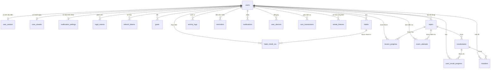
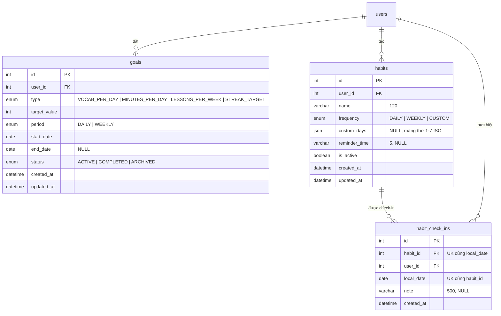
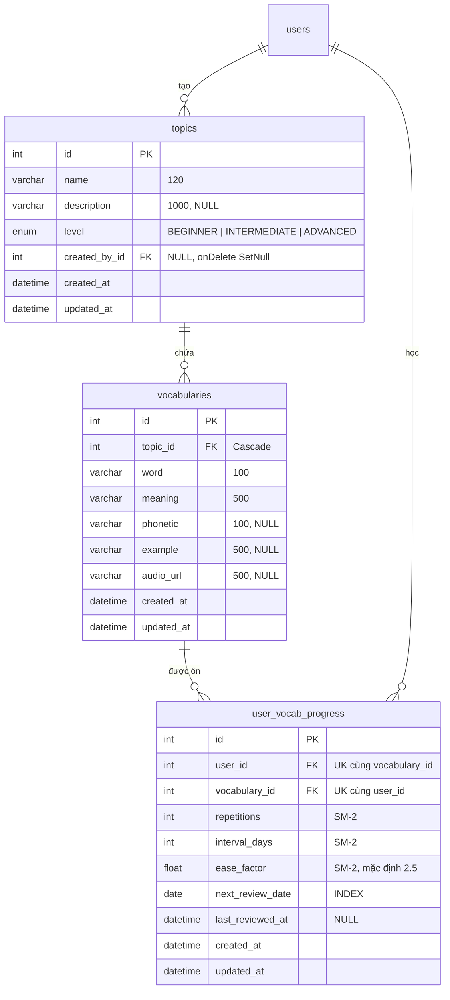
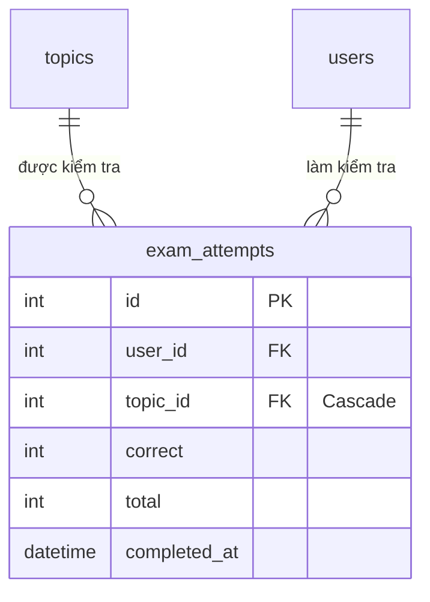
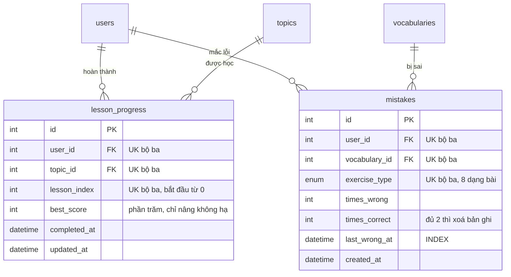
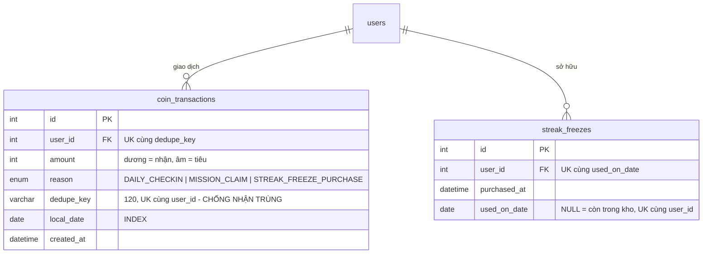

# PHỤ LỤC A — SƠ ĐỒ QUAN HỆ THỰC THỂ (ERD)

> Trích xuất từ `be/prisma/schema.prisma`. Gồm 23 bảng dữ liệu và 12 enum.
> Mã Mermaid bên dưới dán được vào draw.io, Mermaid Live Editor (mermaid.live),
> Notion, Obsidian, hoặc GitHub để sinh ra hình.

---

## A.1. Sơ đồ tổng thể



---

## A.2. Sơ đồ chi tiết theo nhóm

### Nhóm 1 — Người dùng và xác thực

```mermaid
erDiagram
    users {
        int id PK "AUTO_INCREMENT"
        varchar name "100"
        varchar email UK "190"
        varchar password_hash "255, bcrypt"
        enum role "USER | ADMIN"
        enum status "ACTIVE | LOCKED"
        datetime last_login_at "NULL, dẫn xuất"
        varchar timezone "64, IANA"
        datetime created_at
        datetime updated_at
    }

    user_avatars {
        int user_id PK_FK "quan hệ 1-1"
        blob data "MEDIUMBLOB"
        varchar mime_type "30"
        datetime updated_at
    }

    login_events {
        int id PK
        int user_id FK "NULL, onDelete SetNull"
        varchar email "190"
        boolean success
        varchar reason "32, NULL khi thành công"
        varchar ip_address "45, đủ cho IPv6"
        varchar user_agent "255"
        datetime created_at "INDEX"
    }

    refresh_tokens {
        int id PK
        int user_id FK
        varchar token_hash UK "255, SHA-256"
        datetime expires_at
        datetime revoked_at "NULL"
        datetime created_at
    }

    users ||--o| user_avatars : "1-1"
    users ||--o{ login_events : "1-N"
    users ||--o{ refresh_tokens : "1-N"
```

### Nhóm 2 — Mục tiêu và thói quen



### Nhóm 3 — Nội dung học và tiến độ SRS



### Nhóm 4 — Kiểm tra (chế độ "Exam" trong module `lessons`)

> Đề KHÔNG lưu trong DB — sinh động từ `Vocabulary` của cả chủ đề mỗi lần vào, giống cách
> bài học hoạt động (xem `be/src/modules/lessons/exam.service.ts`). Bảng dưới đây chỉ lưu
> điểm để tính "điểm cao nhất" cho mỗi chủ đề, không lưu chi tiết từng câu.



### Nhóm 5 — Hoạt động và chuỗi ngày (trung tâm hệ thống)

```mermaid
erDiagram
    activity_logs {
        int id PK
        int user_id FK "Cascade"
        enum type "VOCAB_LEARNED | FLASHCARD_REVIEWED | QUIZ_COMPLETED | HABIT_CHECKIN"
        int ref_id "NULL, ĐA HÌNH - không ràng buộc FK"
        int value "mặc định 1"
        datetime occurred_at "UTC"
        date local_date "theo timezone user - MỌI thống kê group theo đây"
    }

    user_streaks {
        int user_id PK_FK "quan hệ 1-1"
        int current_streak "CACHE dẫn xuất"
        int longest_streak "CACHE dẫn xuất"
        date last_active_date "NULL"
        datetime updated_at
    }

    users ||--o{ activity_logs : "sinh ra"
    users ||--o| user_streaks : "1-1"
```

**Ghi chú quan trọng:** `activity_logs.ref_id` là quan hệ **đa hình** — trỏ tới
`vocabularies.id`, `habits.id` hoặc `topics.id` (kiểm tra dùng luôn `topics.id`) tuỳ giá trị
cột `type`. Cố ý
không đặt khoá ngoại (comment ở `schema.prisma` dòng 421-422). Trên hình ERD nên vẽ bằng nét
đứt kèm chú thích.

`user_streaks` là **dữ liệu dẫn xuất (cache)**, luôn tái tạo được từ `activity_logs` cộng
`streak_freezes` bằng script `be/prisma/scripts/recompute-streak.ts`.

### Nhóm 6 — Lộ trình học và lỗi sai



**Ghi chú:** nội dung bài học **không lưu trong DB** — bài được sinh ra bằng cách chia danh sách
từ vựng của chủ đề thành từng nhóm 4 từ (`WORDS_PER_LESSON`). Bảng này chỉ ghi user đã qua bài
nào, nhờ vậy thêm từ vựng là lộ trình tự dài ra mà không cần migrate.

### Nhóm 7 — Thông báo và nhắc nhở

```mermaid
erDiagram
    notification_settings {
        int id PK
        int user_id FK_UK "quan hệ 1-1"
        boolean is_enabled "công tắc tổng"
        boolean remind_streak_at_risk
        boolean remind_review_due
        date last_sent_date "NULL"
        datetime updated_at
    }

    reminders {
        int id PK
        int user_id FK "UK cùng time_of_day"
        varchar label "60, NULL"
        varchar time_of_day "5, UK cùng user_id"
        json days_of_week "mảng thứ 1-7 ISO"
        boolean is_enabled "tắt riêng một mốc"
        datetime created_at
        datetime updated_at
    }

    notifications {
        int id PK
        int user_id FK "UK cùng dedupe_key"
        enum type "6 loại"
        varchar title "150"
        varchar body "500"
        varchar link "120, NULL"
        datetime read_at "NULL"
        datetime created_at
        varchar dedupe_key "120, UK cùng user_id"
    }

    user_devices {
        int id PK
        int user_id FK
        varchar player_id UK "200, do OneSignal cấp"
        enum platform "web | ios | android"
        datetime created_at
    }

    users ||--o| notification_settings : "1-1"
    users ||--o{ reminders : "đặt nhiều mốc"
    users ||--o{ notifications : "nhận"
    users ||--o{ user_devices : "đăng ký"
```

### Nhóm 8 — Phần thưởng động viên



**Ghi chú quan trọng:** `coin_transactions` là **sổ cái** — số dư xu = `SUM(amount)`, **không có
cột số dư**. Ràng buộc `UNIQUE(user_id, dedupe_key)` là thứ **duy nhất** chống được việc nhận
thưởng hai lần khi hai request đến cùng lúc.

---

## A.3. Bảng tổng hợp quan hệ

| Bảng nguồn | Bảng đích | Loại | Khoá ngoại | Hành vi khi xoá |
|---|---|---|---|---|
| users | user_avatars | 1-1 | `user_avatars.user_id` (PK) | Cascade |
| users | user_streaks | 1-1 | `user_streaks.user_id` (PK) | Cascade |
| users | notification_settings | 1-1 | `notification_settings.user_id` (UQ) | Cascade |
| users | login_events | 1-N | `login_events.user_id` | **SetNull** |
| users | refresh_tokens | 1-N | `refresh_tokens.user_id` | Cascade |
| users | goals | 1-N | `goals.user_id` | Cascade |
| users | habits | 1-N | `habits.user_id` | Cascade |
| users | habit_check_ins | 1-N | `habit_check_ins.user_id` | Cascade |
| users | activity_logs | 1-N | `activity_logs.user_id` | Cascade |
| users | user_vocab_progress | 1-N | `user_vocab_progress.user_id` | Cascade |
| users | lesson_progress | 1-N | `lesson_progress.user_id` | Cascade |
| users | mistakes | 1-N | `mistakes.user_id` | Cascade |
| users | exam_attempts | 1-N | `exam_attempts.user_id` | Cascade |
| users | reminders | 1-N | `reminders.user_id` | Cascade |
| users | notifications | 1-N | `notifications.user_id` | Cascade |
| users | user_devices | 1-N | `user_devices.user_id` | Cascade |
| users | coin_transactions | 1-N | `coin_transactions.user_id` | Cascade |
| users | streak_freezes | 1-N | `streak_freezes.user_id` | Cascade |
| users | topics | 1-N | `topics.created_by_id` | **SetNull** |
| topics | vocabularies | 1-N | `vocabularies.topic_id` | Cascade |
| topics | exam_attempts | 1-N | `exam_attempts.topic_id` | Cascade |
| topics | lesson_progress | 1-N | `lesson_progress.topic_id` | Cascade |
| vocabularies | user_vocab_progress | 1-N | `user_vocab_progress.vocabulary_id` | Cascade |
| vocabularies | mistakes | 1-N | `mistakes.vocabulary_id` | Cascade |
| habits | habit_check_ins | 1-N | `habit_check_ins.habit_id` | Cascade |
| (đa hình) | activity_logs.ref_id | — | **không có FK** | — |

### Bảng nối thể hiện quan hệ N-N

| Cặp thực thể | Bảng nối | Thuộc tính riêng của quan hệ |
|---|---|---|
| users ↔ vocabularies | `user_vocab_progress` | repetitions, interval_days, ease_factor, next_review_date |
| users ↔ topics | `lesson_progress` | lesson_index, best_score |
| users ↔ topics (Kiểm tra) | `exam_attempts` | correct, total, completed_at |
| users ↔ vocabularies (theo dạng bài) | `mistakes` | exercise_type, times_wrong, times_correct |
| habits ↔ ngày | `habit_check_ins` | local_date, note |

---

## A.4. Danh sách ràng buộc duy nhất (UNIQUE)

Đây là phần đáng nêu riêng trong báo cáo, vì nhiều ràng buộc trong số này **không chỉ để đảm bảo
toàn vẹn dữ liệu mà còn là cơ chế nghiệp vụ chính**.

| Bảng | Ràng buộc | Vai trò nghiệp vụ |
|---|---|---|
| `users` | `email` | Mỗi email một tài khoản |
| `refresh_tokens` | `token_hash` | Mỗi token là duy nhất |
| `user_devices` | `player_id` | Mỗi thiết bị đăng ký một lần |
| `habit_check_ins` | `(habit_id, local_date)` | **Mỗi thói quen mỗi ngày chỉ check-in một lần** |
| `user_vocab_progress` | `(user_id, vocabulary_id)` | Mỗi từ một bản ghi tiến độ cho mỗi người |
| `lesson_progress` | `(user_id, topic_id, lesson_index)` | Mỗi bài một bản ghi tiến độ |
| `mistakes` | `(user_id, vocabulary_id, exercise_type)` | Mỗi từ + dạng bài một bản ghi lỗi |
| `notification_settings` | `user_id` | Quan hệ 1-1 |
| `reminders` | `(user_id, time_of_day)` | **Chặn đặt hai mốc nhắc trùng giờ** |
| `notifications` | `(user_id, dedupe_key)` | **Chống gửi trùng khi cron chạy lại** |
| `coin_transactions` | `(user_id, dedupe_key)` | **Chống nhận thưởng hai lần khi hai request đến cùng lúc** |
| `streak_freezes` | `(user_id, used_on_date)` | **Chặn bù hai vật phẩm cho cùng một ngày** (MySQL cho phép nhiều NULL nên vật phẩm chưa dùng vẫn nằm chung được) |

---

## A.5. Danh sách chỉ mục (INDEX)

| Bảng | Chỉ mục | Phục vụ truy vấn |
|---|---|---|
| `login_events` | `created_at` | Lọc nhật ký theo khoảng thời gian (trang quản trị) |
| `login_events` | `user_id` | Xem lịch sử đăng nhập của một người |
| `refresh_tokens` | `user_id` | Thu hồi toàn bộ phiên của một người |
| `goals` | `(user_id, status)` | Lấy mục tiêu đang hoạt động |
| `habits` | `(user_id, is_active)` | Danh sách thói quen đang bật |
| `habit_check_ins` | `(user_id, local_date)` | Lịch sử check-in theo ngày |
| `topics` | `level` | Lọc chủ đề theo trình độ |
| `vocabularies` | `topic_id` | Lấy từ vựng của một chủ đề |
| `user_vocab_progress` | `(user_id, next_review_date)` | **Lấy thẻ tới hạn ôn** (truy vấn nóng nhất của flashcard) |
| `exam_attempts` | `(user_id, completed_at)` | Lịch sử làm Kiểm tra, tính điểm cao nhất |
| `exam_attempts` | `topic_id` | Thống kê theo chủ đề |
| `activity_logs` | `(user_id, local_date)` | **Thống kê ngày/tuần/tháng, tính streak** |
| `activity_logs` | `(user_id, type, local_date)` | **Tiến độ mục tiêu và nhiệm vụ ngày theo loại hoạt động** |
| `lesson_progress` | `(user_id, topic_id)` | Trạng thái mở khoá bài học |
| `mistakes` | `(user_id, last_wrong_at)` | Danh sách từ sai gần đây |
| `notifications` | `(user_id, read_at)` | Đếm số thông báo chưa đọc |
| `reminders` | `user_id` | Danh sách mốc nhắc của một người |
| `user_devices` | `user_id` | Lấy thiết bị để gửi push |
| `coin_transactions` | `(user_id, local_date)` | Kiểm tra đã điểm danh / nhận thưởng hôm nay chưa |
| `streak_freezes` | `user_id` | Đếm vật phẩm còn trong kho |

---

## A.6. Danh sách enum

| Enum | Giá trị | Dùng ở bảng |
|---|---|---|
| `UserRole` | USER, ADMIN | `users.role` |
| `UserStatus` | ACTIVE, LOCKED | `users.status` |
| `GoalType` | VOCAB_PER_DAY, MINUTES_PER_DAY, LESSONS_PER_WEEK, STREAK_TARGET | `goals.type` |
| `GoalPeriod` | DAILY, WEEKLY | `goals.period` |
| `GoalStatus` | ACTIVE, COMPLETED, ARCHIVED | `goals.status` |
| `HabitFrequency` | DAILY, WEEKLY, CUSTOM | `habits.frequency` |
| `ActivityType` | VOCAB_LEARNED, FLASHCARD_REVIEWED, QUIZ_COMPLETED, HABIT_CHECKIN | `activity_logs.type` |
| `VocabLevel` | BEGINNER, INTERMEDIATE, ADVANCED | `topics.level` |
| `ExerciseType` | CHOOSE_MEANING, CHOOSE_WORD, MATCH_PAIRS, ARRANGE_WORDS, FILL_BLANK, TYPE_WORD, LISTEN_TYPE, LISTEN_CHOOSE | `mistakes.exercise_type` |
| `NotificationType` | DAILY_REMINDER, STREAK_AT_RISK, REVIEW_DUE, MISTAKES_PENDING, GOAL_ACHIEVED, ANNOUNCEMENT | `notifications.type` |
| `DevicePlatform` | web, ios, android | `user_devices.platform` |
| `CoinReason` | DAILY_CHECKIN, MISSION_CLAIM, STREAK_FREEZE_PURCHASE | `coin_transactions.reason` |

Lưu ý: các enum này phải khớp **đúng từng giá trị** giữa `be/prisma/schema.prisma` và
`shared/src/constants/enums.ts` — thêm giá trị mới phải sửa cả hai nơi.

---

*Phụ lục sinh từ `be/prisma/schema.prisma`, ngày 04/09/2026.*
