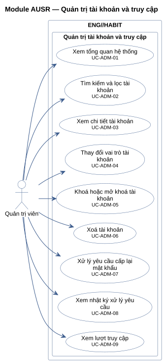
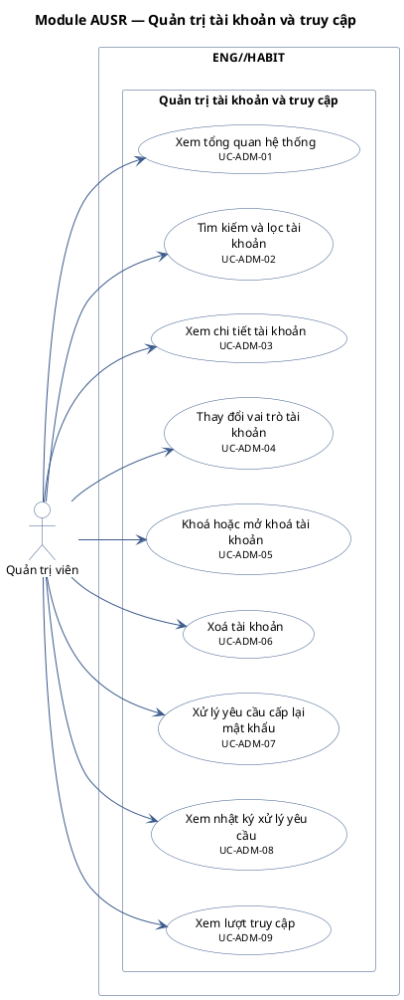

# Module AUSR — Quản trị tài khoản và truy cập

9 use case.

**Cách đọc:** hình người là actor, hình elip là use case, khung ngoài là ranh giới hệ thống
`ENG//HABIT`, khung trong là module. Mũi tên liền từ actor tới use case là association;
mũi tên nét đứt `<<include>>` trỏ từ use case gốc tới use case luôn được gọi; `<<extend>>` trỏ từ
use case mở rộng tới use case gốc; mũi tên tam giác rỗng là generalization (con → cha).
Use case nền vàng mang nhãn `<<Partially Confirmed>>`: có bằng chứng ở mã nguồn nhưng chưa đủ
(xem cột Trạng thái trong `USE-CASE-INVENTORY.md`).

## Mã nguồn PlantUML

## Use case trong sơ đồ

| ID | Use Case | Actor (association) | Trạng thái |
|---|---|---|---|
| UC-ADM-01 | Xem tổng quan hệ thống | Quản trị viên | Confirmed |
| UC-ADM-02 | Tìm kiếm và lọc tài khoản | Quản trị viên | Confirmed |
| UC-ADM-03 | Xem chi tiết tài khoản | Quản trị viên | Confirmed |
| UC-ADM-04 | Thay đổi vai trò tài khoản | Quản trị viên | Confirmed |
| UC-ADM-05 | Khoá hoặc mở khoá tài khoản | Quản trị viên | Confirmed |
| UC-ADM-06 | Xoá tài khoản | Quản trị viên | Confirmed |
| UC-ADM-07 | Xử lý yêu cầu cấp lại mật khẩu | Quản trị viên | Confirmed |
| UC-ADM-08 | Xem nhật ký xử lý yêu cầu | Quản trị viên | Confirmed |
| UC-ADM-09 | Xem lượt truy cập | Quản trị viên | Confirmed |
