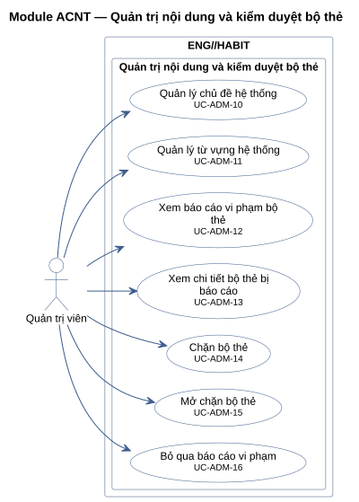
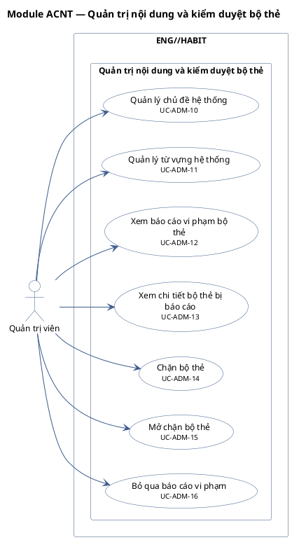

# Module ACNT — Quản trị nội dung và kiểm duyệt bộ thẻ

7 use case.

**Cách đọc:** hình người là actor, hình elip là use case, khung ngoài là ranh giới hệ thống
`ENG//HABIT`, khung trong là module. Mũi tên liền từ actor tới use case là association;
mũi tên nét đứt `<<include>>` trỏ từ use case gốc tới use case luôn được gọi; `<<extend>>` trỏ từ
use case mở rộng tới use case gốc; mũi tên tam giác rỗng là generalization (con → cha).
Use case nền vàng mang nhãn `<<Partially Confirmed>>`: có bằng chứng ở mã nguồn nhưng chưa đủ
(xem cột Trạng thái trong `USE-CASE-INVENTORY.md`).

## Mã nguồn PlantUML

## Use case trong sơ đồ

| ID | Use Case | Actor (association) | Trạng thái |
|---|---|---|---|
| UC-ADM-10 | Quản lý chủ đề hệ thống | Quản trị viên | Confirmed |
| UC-ADM-11 | Quản lý từ vựng hệ thống | Quản trị viên | Confirmed |
| UC-ADM-12 | Xem báo cáo vi phạm bộ thẻ | Quản trị viên | Confirmed |
| UC-ADM-13 | Xem chi tiết bộ thẻ bị báo cáo | Quản trị viên | Confirmed |
| UC-ADM-14 | Chặn bộ thẻ | Quản trị viên | Confirmed |
| UC-ADM-15 | Mở chặn bộ thẻ | Quản trị viên | Confirmed |
| UC-ADM-16 | Bỏ qua báo cáo vi phạm | Quản trị viên | Confirmed |
