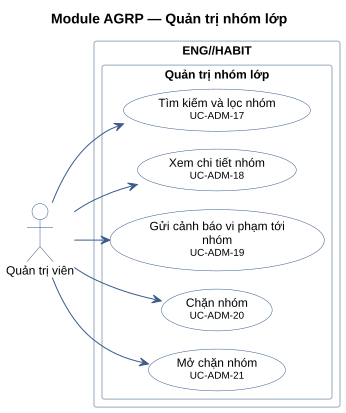
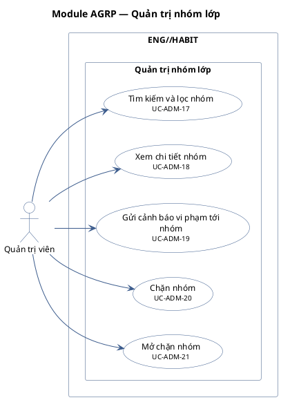

# Module AGRP — Quản trị nhóm lớp

5 use case.

**Cách đọc:** hình người là actor, hình elip là use case, khung ngoài là ranh giới hệ thống
`ENG//HABIT`, khung trong là module. Mũi tên liền từ actor tới use case là association;
mũi tên nét đứt `<<include>>` trỏ từ use case gốc tới use case luôn được gọi; `<<extend>>` trỏ từ
use case mở rộng tới use case gốc; mũi tên tam giác rỗng là generalization (con → cha).
Use case nền vàng mang nhãn `<<Partially Confirmed>>`: có bằng chứng ở mã nguồn nhưng chưa đủ
(xem cột Trạng thái trong `USE-CASE-INVENTORY.md`).

## Mã nguồn PlantUML

## Use case trong sơ đồ

| ID | Use Case | Actor (association) | Trạng thái |
|---|---|---|---|
| UC-ADM-17 | Tìm kiếm và lọc nhóm | Quản trị viên | Confirmed |
| UC-ADM-18 | Xem chi tiết nhóm | Quản trị viên | Confirmed |
| UC-ADM-19 | Gửi cảnh báo vi phạm tới nhóm | Quản trị viên | Confirmed |
| UC-ADM-20 | Chặn nhóm | Quản trị viên | Confirmed |
| UC-ADM-21 | Mở chặn nhóm | Quản trị viên | Confirmed |
