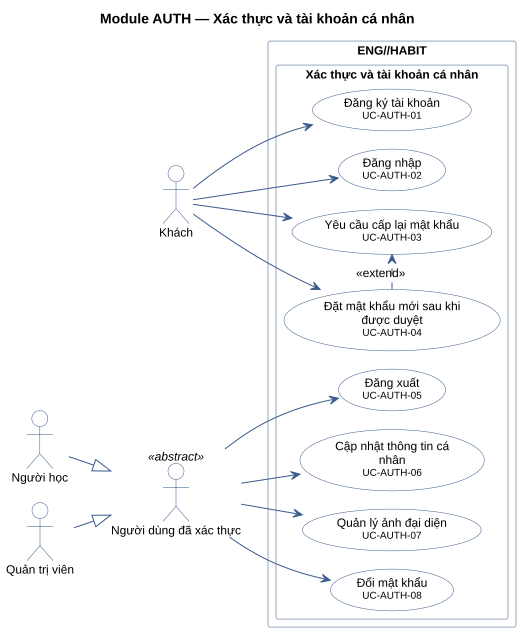
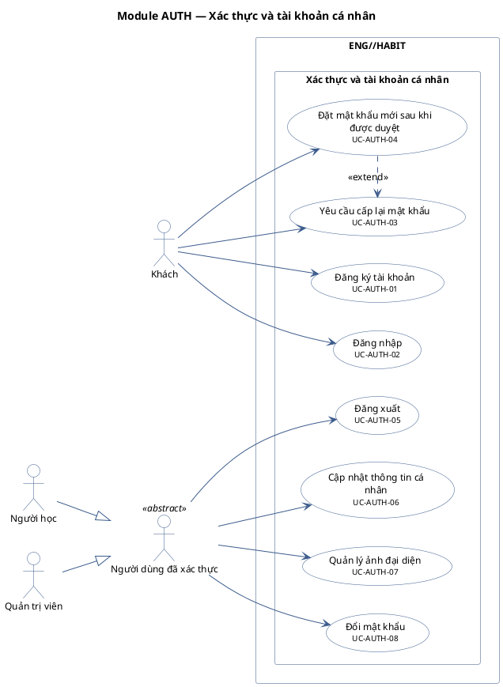

# Module AUTH — Xác thực và tài khoản cá nhân

8 use case.

**Cách đọc:** hình người là actor, hình elip là use case, khung ngoài là ranh giới hệ thống
`ENG//HABIT`, khung trong là module. Mũi tên liền từ actor tới use case là association;
mũi tên nét đứt `<<include>>` trỏ từ use case gốc tới use case luôn được gọi; `<<extend>>` trỏ từ
use case mở rộng tới use case gốc; mũi tên tam giác rỗng là generalization (con → cha).
Use case nền vàng mang nhãn `<<Partially Confirmed>>`: có bằng chứng ở mã nguồn nhưng chưa đủ
(xem cột Trạng thái trong `USE-CASE-INVENTORY.md`).

## Mã nguồn PlantUML

## Use case trong sơ đồ

| ID | Use Case | Actor (association) | Trạng thái |
|---|---|---|---|
| UC-AUTH-01 | Đăng ký tài khoản | Khách | Confirmed |
| UC-AUTH-02 | Đăng nhập | Khách | Confirmed |
| UC-AUTH-03 | Yêu cầu cấp lại mật khẩu | Khách | Confirmed |
| UC-AUTH-04 | Đặt mật khẩu mới sau khi được duyệt | Khách | Confirmed |
| UC-AUTH-05 | Đăng xuất | Người dùng đã xác thực | Confirmed |
| UC-AUTH-06 | Cập nhật thông tin cá nhân | Người dùng đã xác thực | Confirmed |
| UC-AUTH-07 | Quản lý ảnh đại diện | Người dùng đã xác thực | Confirmed |
| UC-AUTH-08 | Đổi mật khẩu | Người dùng đã xác thực | Confirmed |
