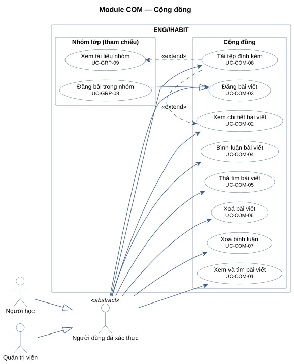
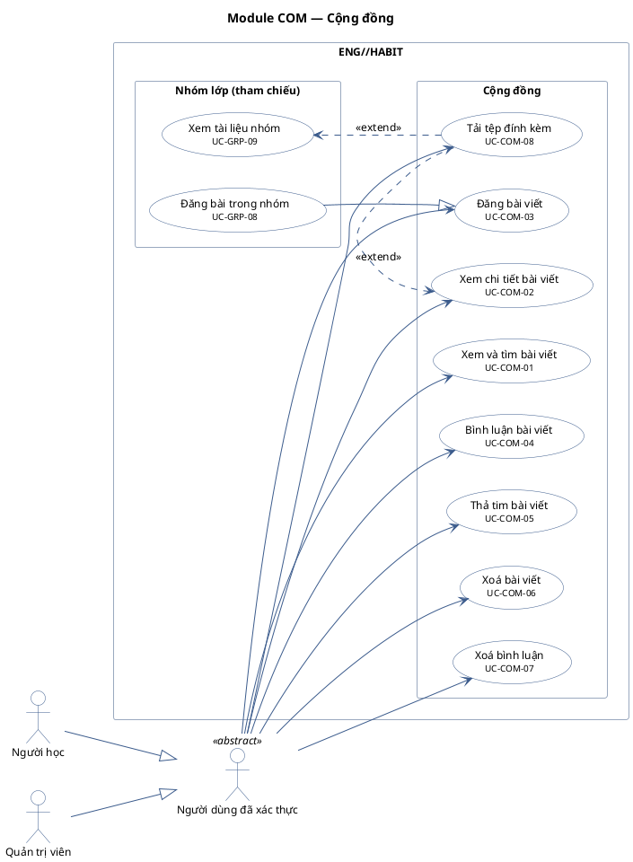

# Module COM — Cộng đồng

8 use case.
Use case của module khác xuất hiện trong khung "(tham chiếu)" chỉ để thể hiện quan hệ; association của chúng vẽ ở sơ đồ module gốc: UC-GRP-09, UC-GRP-08.

**Cách đọc:** hình người là actor, hình elip là use case, khung ngoài là ranh giới hệ thống
`ENG//HABIT`, khung trong là module. Mũi tên liền từ actor tới use case là association;
mũi tên nét đứt `<<include>>` trỏ từ use case gốc tới use case luôn được gọi; `<<extend>>` trỏ từ
use case mở rộng tới use case gốc; mũi tên tam giác rỗng là generalization (con → cha).
Use case nền vàng mang nhãn `<<Partially Confirmed>>`: có bằng chứng ở mã nguồn nhưng chưa đủ
(xem cột Trạng thái trong `USE-CASE-INVENTORY.md`).

## Mã nguồn PlantUML

## Use case trong sơ đồ

| ID | Use Case | Actor (association) | Trạng thái |
|---|---|---|---|
| UC-COM-01 | Xem và tìm bài viết | Người dùng đã xác thực | Confirmed |
| UC-COM-02 | Xem chi tiết bài viết | Người dùng đã xác thực | Confirmed |
| UC-COM-03 | Đăng bài viết | Người dùng đã xác thực | Confirmed |
| UC-COM-04 | Bình luận bài viết | Người dùng đã xác thực | Confirmed |
| UC-COM-05 | Thả tim bài viết | Người dùng đã xác thực | Confirmed |
| UC-COM-06 | Xoá bài viết | Người dùng đã xác thực | Confirmed |
| UC-COM-07 | Xoá bình luận | Người dùng đã xác thực | Confirmed |
| UC-COM-08 | Tải tệp đính kèm | Người dùng đã xác thực | Confirmed |
| UC-GRP-08 | Đăng bài trong nhóm | Người học | Confirmed |
| UC-GRP-09 | Xem tài liệu nhóm | Người học | Confirmed |
