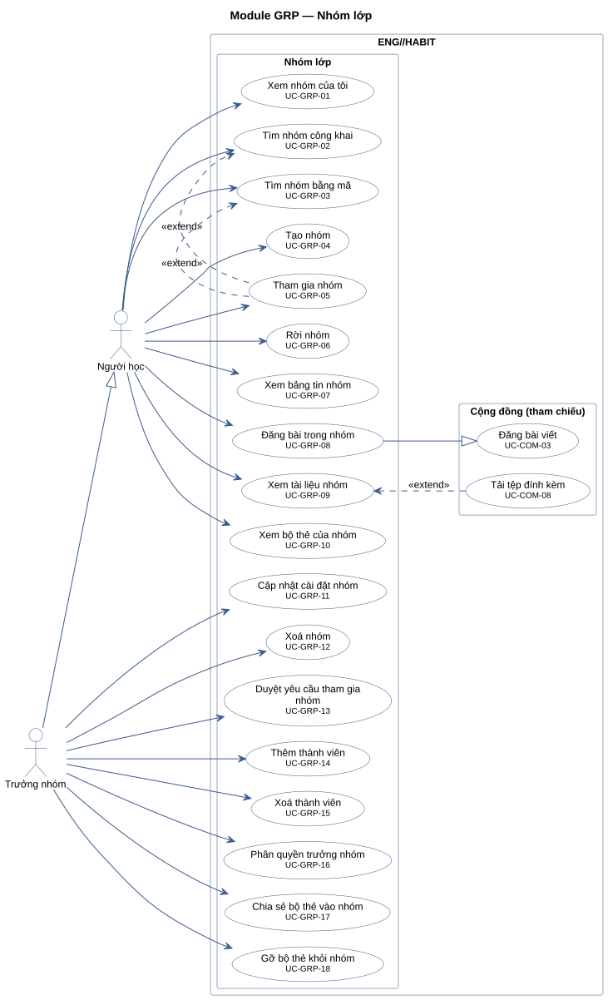
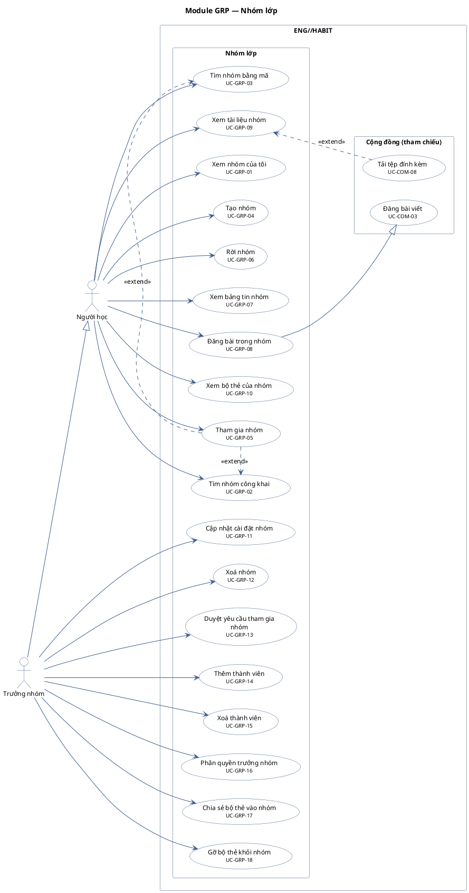

# Module GRP — Nhóm lớp

18 use case.
Use case của module khác xuất hiện trong khung "(tham chiếu)" chỉ để thể hiện quan hệ; association của chúng vẽ ở sơ đồ module gốc: UC-COM-08, UC-COM-03.

**Cách đọc:** hình người là actor, hình elip là use case, khung ngoài là ranh giới hệ thống
`ENG//HABIT`, khung trong là module. Mũi tên liền từ actor tới use case là association;
mũi tên nét đứt `<<include>>` trỏ từ use case gốc tới use case luôn được gọi; `<<extend>>` trỏ từ
use case mở rộng tới use case gốc; mũi tên tam giác rỗng là generalization (con → cha).
Use case nền vàng mang nhãn `<<Partially Confirmed>>`: có bằng chứng ở mã nguồn nhưng chưa đủ
(xem cột Trạng thái trong `USE-CASE-INVENTORY.md`).

## Mã nguồn PlantUML

## Use case trong sơ đồ

| ID | Use Case | Actor (association) | Trạng thái |
|---|---|---|---|
| UC-COM-03 | Đăng bài viết | Người dùng đã xác thực | Confirmed |
| UC-COM-08 | Tải tệp đính kèm | Người dùng đã xác thực | Confirmed |
| UC-GRP-01 | Xem nhóm của tôi | Người học | Confirmed |
| UC-GRP-02 | Tìm nhóm công khai | Người học | Confirmed |
| UC-GRP-03 | Tìm nhóm bằng mã | Người học | Confirmed |
| UC-GRP-04 | Tạo nhóm | Người học | Confirmed |
| UC-GRP-05 | Tham gia nhóm | Người học | Confirmed |
| UC-GRP-06 | Rời nhóm | Người học | Confirmed |
| UC-GRP-07 | Xem bảng tin nhóm | Người học | Confirmed |
| UC-GRP-08 | Đăng bài trong nhóm | Người học | Confirmed |
| UC-GRP-09 | Xem tài liệu nhóm | Người học | Confirmed |
| UC-GRP-10 | Xem bộ thẻ của nhóm | Người học | Confirmed |
| UC-GRP-11 | Cập nhật cài đặt nhóm | Trưởng nhóm | Confirmed |
| UC-GRP-12 | Xoá nhóm | Trưởng nhóm | Confirmed |
| UC-GRP-13 | Duyệt yêu cầu tham gia nhóm | Trưởng nhóm | Confirmed |
| UC-GRP-14 | Thêm thành viên | Trưởng nhóm | Confirmed |
| UC-GRP-15 | Xoá thành viên | Trưởng nhóm | Confirmed |
| UC-GRP-16 | Phân quyền trưởng nhóm | Trưởng nhóm | Confirmed |
| UC-GRP-17 | Chia sẻ bộ thẻ vào nhóm | Trưởng nhóm | Confirmed |
| UC-GRP-18 | Gỡ bộ thẻ khỏi nhóm | Trưởng nhóm | Confirmed |
