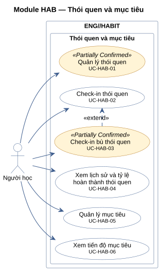
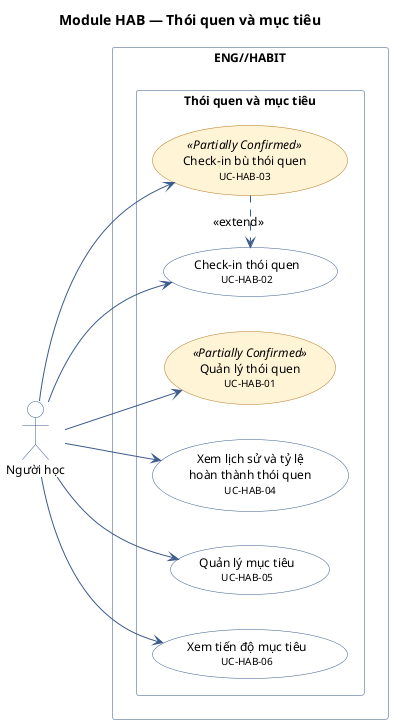

# Module HAB — Thói quen và mục tiêu

6 use case.

**Cách đọc:** hình người là actor, hình elip là use case, khung ngoài là ranh giới hệ thống
`ENG//HABIT`, khung trong là module. Mũi tên liền từ actor tới use case là association;
mũi tên nét đứt `<<include>>` trỏ từ use case gốc tới use case luôn được gọi; `<<extend>>` trỏ từ
use case mở rộng tới use case gốc; mũi tên tam giác rỗng là generalization (con → cha).
Use case nền vàng mang nhãn `<<Partially Confirmed>>`: có bằng chứng ở mã nguồn nhưng chưa đủ
(xem cột Trạng thái trong `USE-CASE-INVENTORY.md`).

## Mã nguồn PlantUML

## Use case trong sơ đồ

| ID | Use Case | Actor (association) | Trạng thái |
|---|---|---|---|
| UC-HAB-01 | Quản lý thói quen | Người học | Partially Confirmed |
| UC-HAB-02 | Check-in thói quen | Người học | Confirmed |
| UC-HAB-03 | Check-in bù thói quen | Người học | Partially Confirmed |
| UC-HAB-04 | Xem lịch sử và tỷ lệ hoàn thành thói quen | Người học | Confirmed |
| UC-HAB-05 | Quản lý mục tiêu | Người học | Confirmed |
| UC-HAB-06 | Xem tiến độ mục tiêu | Người học | Confirmed |
