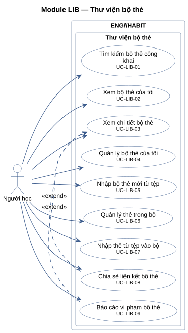
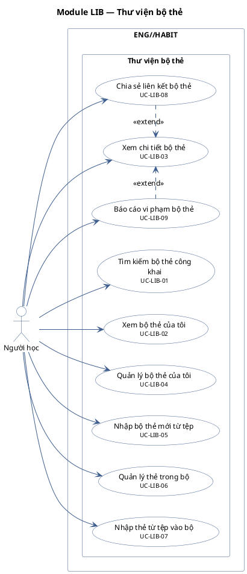

# Module LIB — Thư viện bộ thẻ

9 use case.

**Cách đọc:** hình người là actor, hình elip là use case, khung ngoài là ranh giới hệ thống
`ENG//HABIT`, khung trong là module. Mũi tên liền từ actor tới use case là association;
mũi tên nét đứt `<<include>>` trỏ từ use case gốc tới use case luôn được gọi; `<<extend>>` trỏ từ
use case mở rộng tới use case gốc; mũi tên tam giác rỗng là generalization (con → cha).
Use case nền vàng mang nhãn `<<Partially Confirmed>>`: có bằng chứng ở mã nguồn nhưng chưa đủ
(xem cột Trạng thái trong `USE-CASE-INVENTORY.md`).

## Mã nguồn PlantUML

## Use case trong sơ đồ

| ID | Use Case | Actor (association) | Trạng thái |
|---|---|---|---|
| UC-LIB-01 | Tìm kiếm bộ thẻ công khai | Người học | Confirmed |
| UC-LIB-02 | Xem bộ thẻ của tôi | Người học | Confirmed |
| UC-LIB-03 | Xem chi tiết bộ thẻ | Người học | Confirmed |
| UC-LIB-04 | Quản lý bộ thẻ của tôi | Người học | Confirmed |
| UC-LIB-05 | Nhập bộ thẻ mới từ tệp | Người học | Confirmed |
| UC-LIB-06 | Quản lý thẻ trong bộ | Người học | Confirmed |
| UC-LIB-07 | Nhập thẻ từ tệp vào bộ | Người học | Confirmed |
| UC-LIB-08 | Chia sẻ liên kết bộ thẻ | Người học | Confirmed |
| UC-LIB-09 | Báo cáo vi phạm bộ thẻ | Người học | Confirmed |
