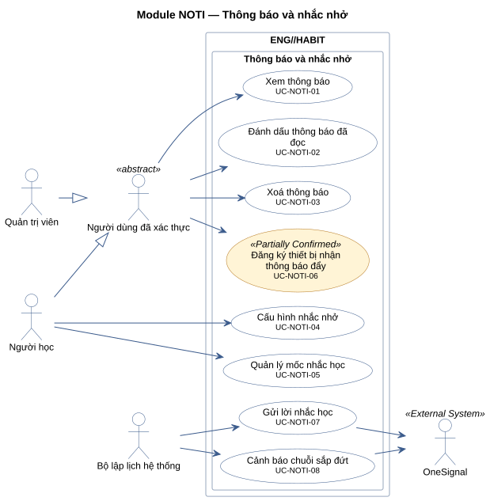
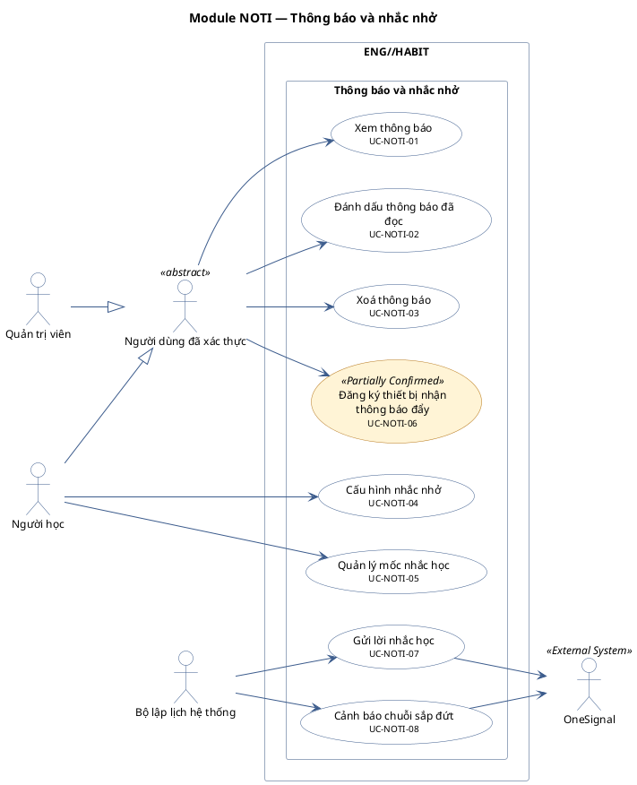

# Module NOTI — Thông báo và nhắc nhở

8 use case.

**Cách đọc:** hình người là actor, hình elip là use case, khung ngoài là ranh giới hệ thống
`ENG//HABIT`, khung trong là module. Mũi tên liền từ actor tới use case là association;
mũi tên nét đứt `<<include>>` trỏ từ use case gốc tới use case luôn được gọi; `<<extend>>` trỏ từ
use case mở rộng tới use case gốc; mũi tên tam giác rỗng là generalization (con → cha).
Use case nền vàng mang nhãn `<<Partially Confirmed>>`: có bằng chứng ở mã nguồn nhưng chưa đủ
(xem cột Trạng thái trong `USE-CASE-INVENTORY.md`).

## Mã nguồn PlantUML

## Use case trong sơ đồ

| ID | Use Case | Actor (association) | Trạng thái |
|---|---|---|---|
| UC-NOTI-01 | Xem thông báo | Người dùng đã xác thực | Confirmed |
| UC-NOTI-02 | Đánh dấu thông báo đã đọc | Người dùng đã xác thực | Confirmed |
| UC-NOTI-03 | Xoá thông báo | Người dùng đã xác thực | Confirmed |
| UC-NOTI-04 | Cấu hình nhắc nhở | Người học | Confirmed |
| UC-NOTI-05 | Quản lý mốc nhắc học | Người học | Confirmed |
| UC-NOTI-06 | Đăng ký thiết bị nhận thông báo đẩy | Người dùng đã xác thực | Partially Confirmed |
| UC-NOTI-07 | Gửi lời nhắc học | Bộ lập lịch hệ thống, OneSignal | Confirmed |
| UC-NOTI-08 | Cảnh báo chuỗi sắp đứt | Bộ lập lịch hệ thống, OneSignal | Confirmed |
