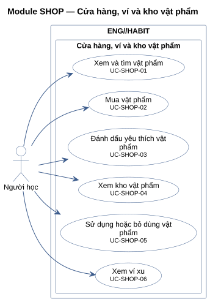
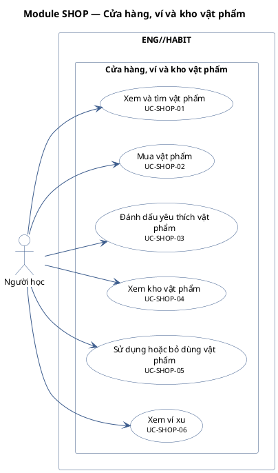

# Module SHOP — Cửa hàng, ví và kho vật phẩm

6 use case.

**Cách đọc:** hình người là actor, hình elip là use case, khung ngoài là ranh giới hệ thống
`ENG//HABIT`, khung trong là module. Mũi tên liền từ actor tới use case là association;
mũi tên nét đứt `<<include>>` trỏ từ use case gốc tới use case luôn được gọi; `<<extend>>` trỏ từ
use case mở rộng tới use case gốc; mũi tên tam giác rỗng là generalization (con → cha).
Use case nền vàng mang nhãn `<<Partially Confirmed>>`: có bằng chứng ở mã nguồn nhưng chưa đủ
(xem cột Trạng thái trong `USE-CASE-INVENTORY.md`).

## Mã nguồn PlantUML

## Use case trong sơ đồ

| ID | Use Case | Actor (association) | Trạng thái |
|---|---|---|---|
| UC-SHOP-01 | Xem và tìm vật phẩm | Người học | Confirmed |
| UC-SHOP-02 | Mua vật phẩm | Người học | Confirmed |
| UC-SHOP-03 | Đánh dấu yêu thích vật phẩm | Người học | Confirmed |
| UC-SHOP-04 | Xem kho vật phẩm | Người học | Confirmed |
| UC-SHOP-05 | Sử dụng hoặc bỏ dùng vật phẩm | Người học | Confirmed |
| UC-SHOP-06 | Xem ví xu | Người học | Confirmed |
