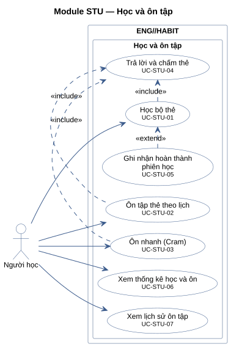
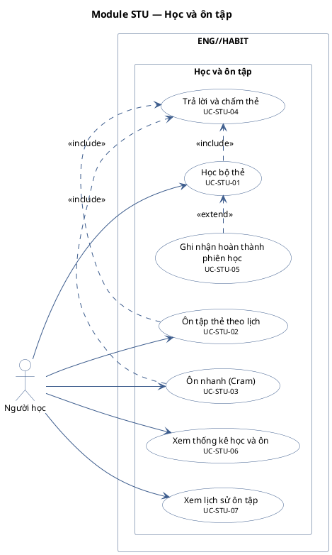

# Module STU — Học và ôn tập

7 use case.

**Cách đọc:** hình người là actor, hình elip là use case, khung ngoài là ranh giới hệ thống
`ENG//HABIT`, khung trong là module. Mũi tên liền từ actor tới use case là association;
mũi tên nét đứt `<<include>>` trỏ từ use case gốc tới use case luôn được gọi; `<<extend>>` trỏ từ
use case mở rộng tới use case gốc; mũi tên tam giác rỗng là generalization (con → cha).
Use case nền vàng mang nhãn `<<Partially Confirmed>>`: có bằng chứng ở mã nguồn nhưng chưa đủ
(xem cột Trạng thái trong `USE-CASE-INVENTORY.md`).

## Mã nguồn PlantUML

## Use case trong sơ đồ

| ID | Use Case | Actor (association) | Trạng thái |
|---|---|---|---|
| UC-STU-01 | Học bộ thẻ | Người học | Confirmed |
| UC-STU-02 | Ôn tập thẻ theo lịch | Người học | Confirmed |
| UC-STU-03 | Ôn nhanh (Cram) | Người học | Confirmed |
| UC-STU-04 | Trả lời và chấm thẻ | — (chỉ qua quan hệ) | Confirmed |
| UC-STU-05 | Ghi nhận hoàn thành phiên học | — (chỉ qua quan hệ) | Confirmed |
| UC-STU-06 | Xem thống kê học và ôn | Người học | Confirmed |
| UC-STU-07 | Xem lịch sử ôn tập | Người học | Confirmed |
