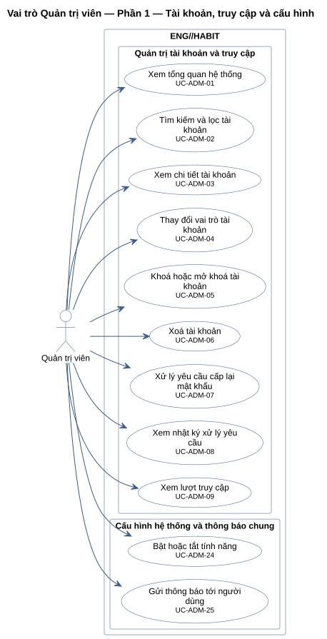
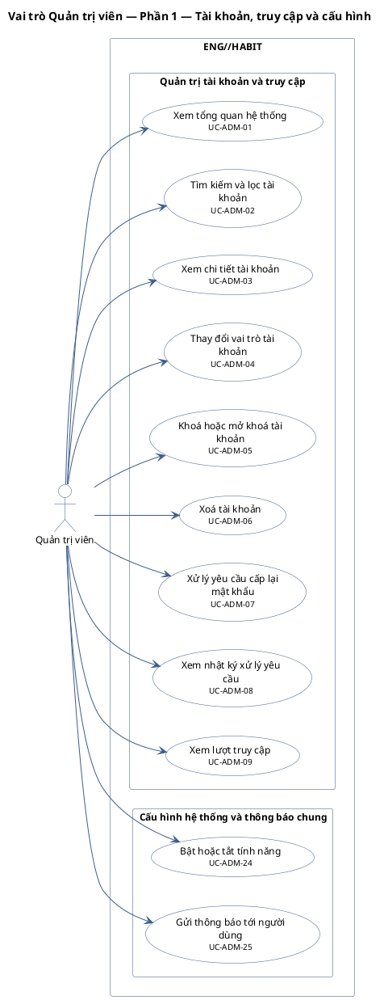
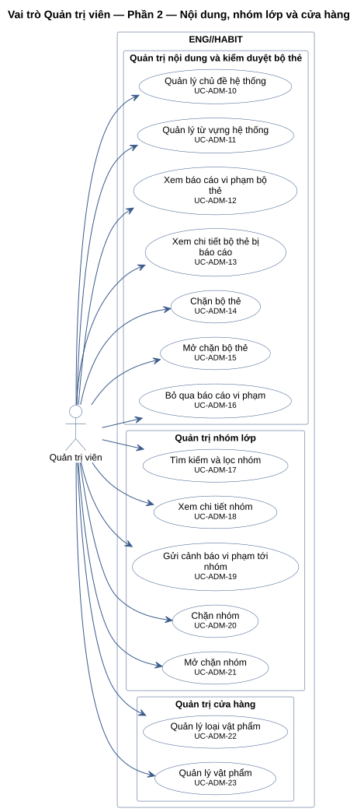
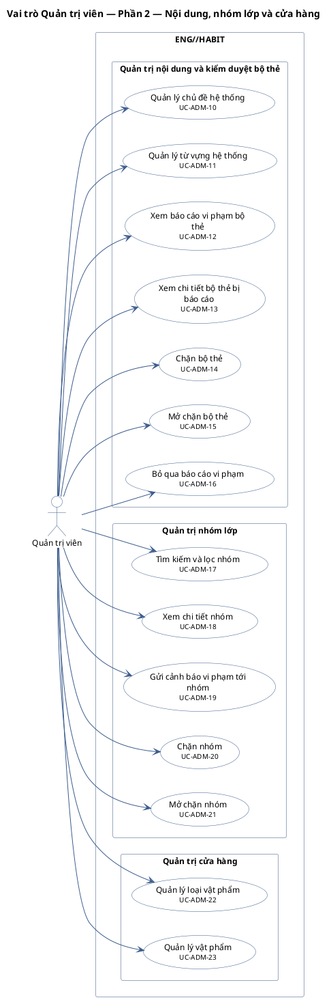
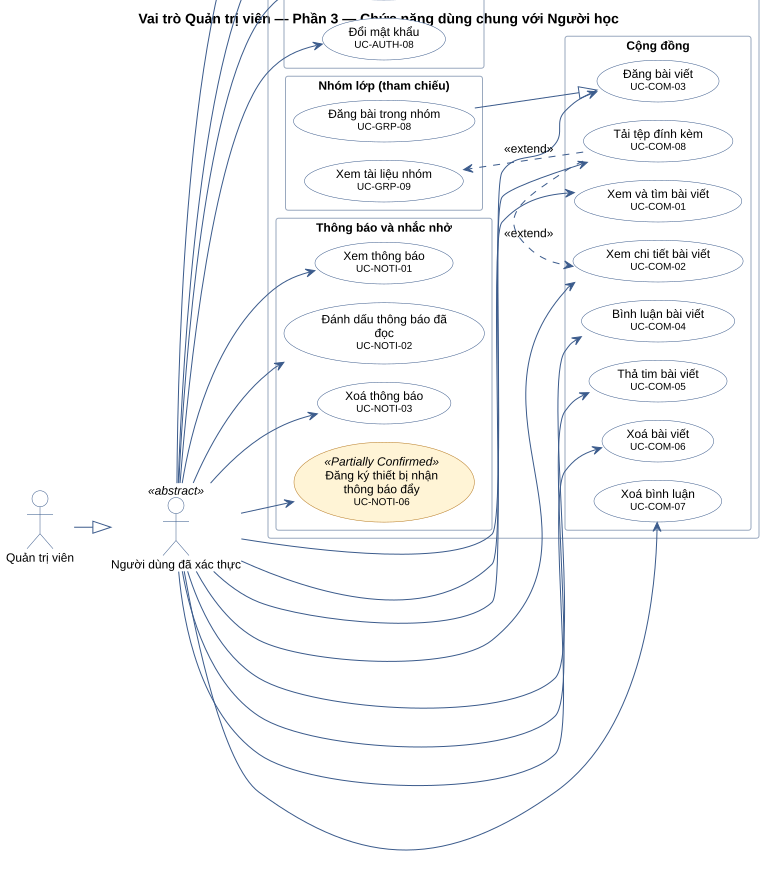
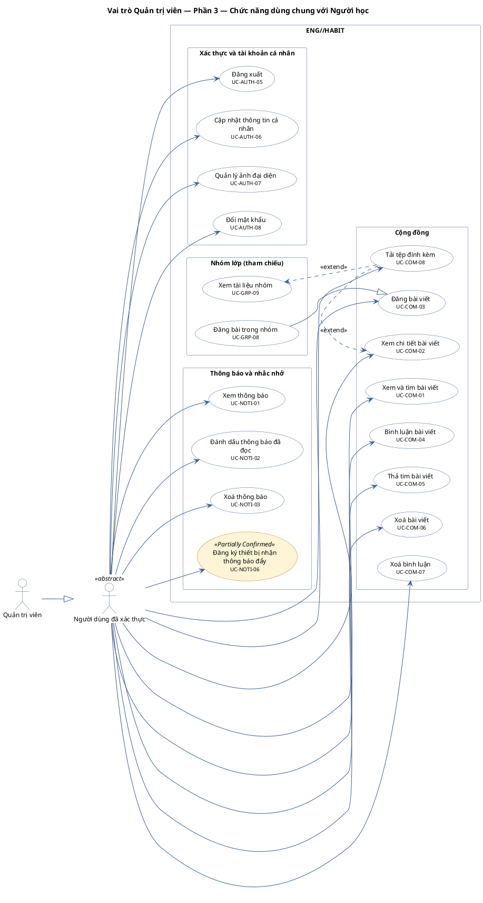

# Vai trò Quản trị viên

Mọi use case một tài khoản `ADMIN` dùng được. Quản trị viên KHÔNG có use case học tập, phần thưởng, cửa hàng, nhóm lớp của người học, cấu hình nhắc nhở.

Tổng số use case của vai trò trong tài liệu này: 41, chia thành 3 sơ đồ theo nhóm module để giữ sơ đồ dễ đọc.

**Cách đọc:** hình người là actor, hình elip là use case, khung ngoài là ranh giới hệ thống
`ENG//HABIT`, khung trong là module. Mũi tên liền từ actor tới use case là association;
mũi tên nét đứt `<<include>>` trỏ từ use case gốc tới use case luôn được gọi; `<<extend>>` trỏ từ
use case mở rộng tới use case gốc; mũi tên tam giác rỗng là generalization (con → cha).
Use case nền vàng mang nhãn `<<Partially Confirmed>>`: có bằng chứng ở mã nguồn nhưng chưa đủ
(xem cột Trạng thái trong `USE-CASE-INVENTORY.md`).

## Vai trò Quản trị viên — Phần 1 — Tài khoản, truy cập và cấu hình

11 use case.

| ID | Use Case | Actor (association) | Trạng thái |
|---|---|---|---|
| UC-ADM-01 | Xem tổng quan hệ thống | Quản trị viên | Confirmed |
| UC-ADM-02 | Tìm kiếm và lọc tài khoản | Quản trị viên | Confirmed |
| UC-ADM-03 | Xem chi tiết tài khoản | Quản trị viên | Confirmed |
| UC-ADM-04 | Thay đổi vai trò tài khoản | Quản trị viên | Confirmed |
| UC-ADM-05 | Khoá hoặc mở khoá tài khoản | Quản trị viên | Confirmed |
| UC-ADM-06 | Xoá tài khoản | Quản trị viên | Confirmed |
| UC-ADM-07 | Xử lý yêu cầu cấp lại mật khẩu | Quản trị viên | Confirmed |
| UC-ADM-08 | Xem nhật ký xử lý yêu cầu | Quản trị viên | Confirmed |
| UC-ADM-09 | Xem lượt truy cập | Quản trị viên | Confirmed |
| UC-ADM-24 | Bật hoặc tắt tính năng | Quản trị viên | Confirmed |
| UC-ADM-25 | Gửi thông báo tới người dùng | Quản trị viên | Confirmed |

## Vai trò Quản trị viên — Phần 2 — Nội dung, nhóm lớp và cửa hàng

14 use case.

| ID | Use Case | Actor (association) | Trạng thái |
|---|---|---|---|
| UC-ADM-10 | Quản lý chủ đề hệ thống | Quản trị viên | Confirmed |
| UC-ADM-11 | Quản lý từ vựng hệ thống | Quản trị viên | Confirmed |
| UC-ADM-12 | Xem báo cáo vi phạm bộ thẻ | Quản trị viên | Confirmed |
| UC-ADM-13 | Xem chi tiết bộ thẻ bị báo cáo | Quản trị viên | Confirmed |
| UC-ADM-14 | Chặn bộ thẻ | Quản trị viên | Confirmed |
| UC-ADM-15 | Mở chặn bộ thẻ | Quản trị viên | Confirmed |
| UC-ADM-16 | Bỏ qua báo cáo vi phạm | Quản trị viên | Confirmed |
| UC-ADM-17 | Tìm kiếm và lọc nhóm | Quản trị viên | Confirmed |
| UC-ADM-18 | Xem chi tiết nhóm | Quản trị viên | Confirmed |
| UC-ADM-19 | Gửi cảnh báo vi phạm tới nhóm | Quản trị viên | Confirmed |
| UC-ADM-20 | Chặn nhóm | Quản trị viên | Confirmed |
| UC-ADM-21 | Mở chặn nhóm | Quản trị viên | Confirmed |
| UC-ADM-22 | Quản lý loại vật phẩm | Quản trị viên | Confirmed |
| UC-ADM-23 | Quản lý vật phẩm | Quản trị viên | Confirmed |

## Vai trò Quản trị viên — Phần 3 — Chức năng dùng chung với Người học

16 use case.

| ID | Use Case | Actor (association) | Trạng thái |
|---|---|---|---|
| UC-AUTH-05 | Đăng xuất | Người dùng đã xác thực | Confirmed |
| UC-AUTH-06 | Cập nhật thông tin cá nhân | Người dùng đã xác thực | Confirmed |
| UC-AUTH-07 | Quản lý ảnh đại diện | Người dùng đã xác thực | Confirmed |
| UC-AUTH-08 | Đổi mật khẩu | Người dùng đã xác thực | Confirmed |
| UC-COM-01 | Xem và tìm bài viết | Người dùng đã xác thực | Confirmed |
| UC-COM-02 | Xem chi tiết bài viết | Người dùng đã xác thực | Confirmed |
| UC-COM-03 | Đăng bài viết | Người dùng đã xác thực | Confirmed |
| UC-COM-04 | Bình luận bài viết | Người dùng đã xác thực | Confirmed |
| UC-COM-05 | Thả tim bài viết | Người dùng đã xác thực | Confirmed |
| UC-COM-06 | Xoá bài viết | Người dùng đã xác thực | Confirmed |
| UC-COM-07 | Xoá bình luận | Người dùng đã xác thực | Confirmed |
| UC-COM-08 | Tải tệp đính kèm | Người dùng đã xác thực | Confirmed |
| UC-GRP-08 | Đăng bài trong nhóm | Người học | Confirmed |
| UC-GRP-09 | Xem tài liệu nhóm | Người học | Confirmed |
| UC-NOTI-01 | Xem thông báo | Người dùng đã xác thực | Confirmed |
| UC-NOTI-02 | Đánh dấu thông báo đã đọc | Người dùng đã xác thực | Confirmed |
| UC-NOTI-03 | Xoá thông báo | Người dùng đã xác thực | Confirmed |
| UC-NOTI-06 | Đăng ký thiết bị nhận thông báo đẩy | Người dùng đã xác thực | Partially Confirmed |
