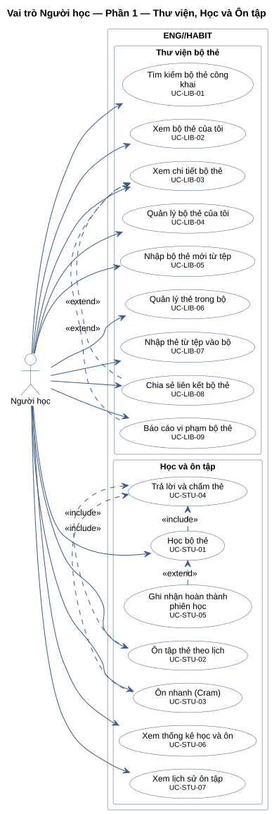
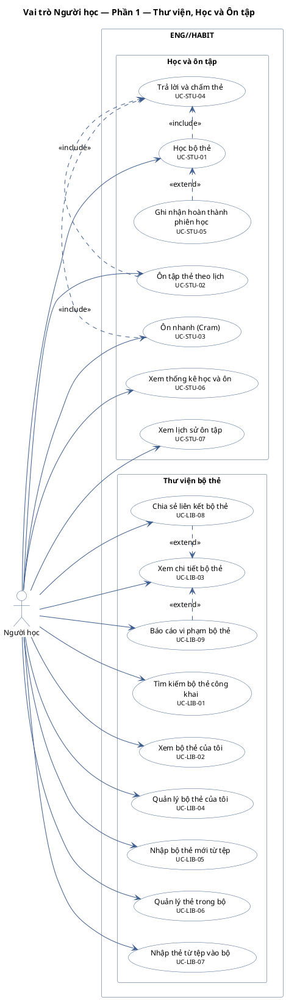
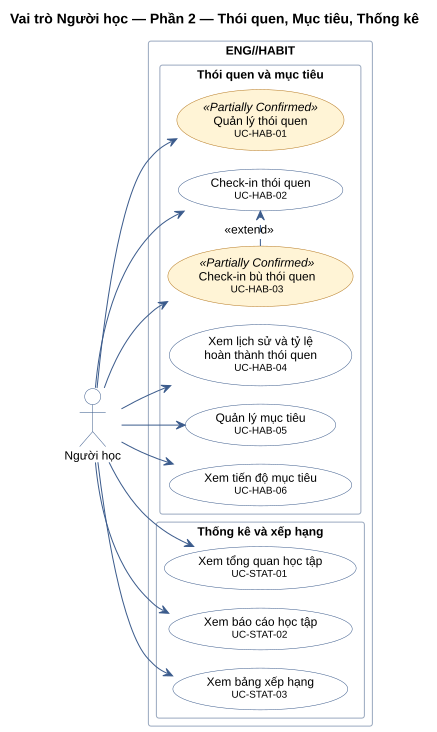
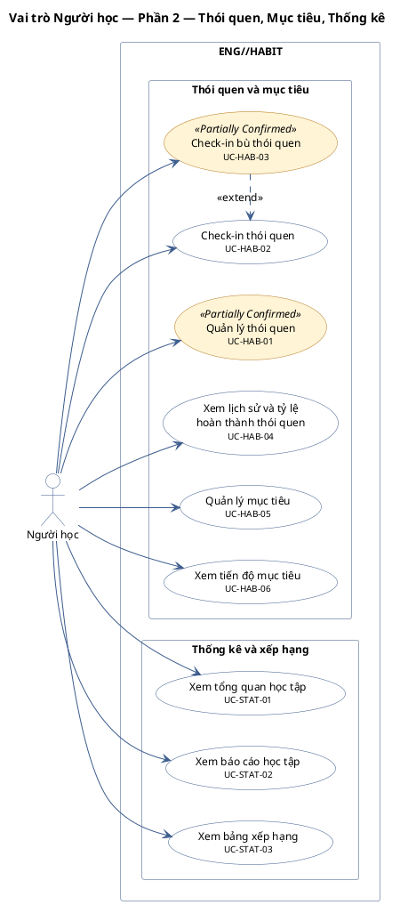
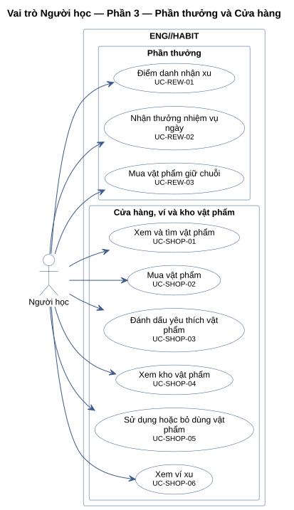
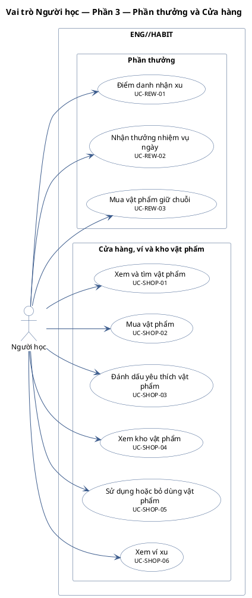
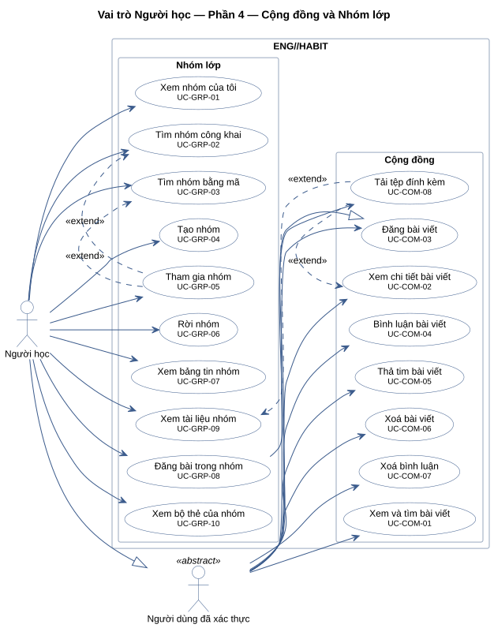
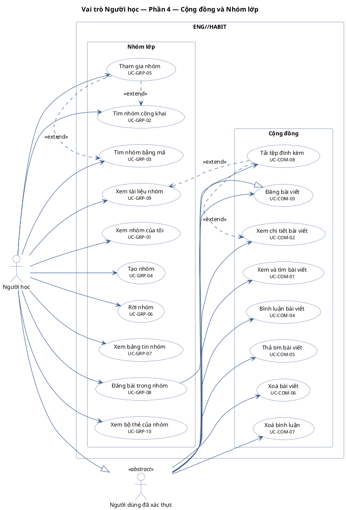
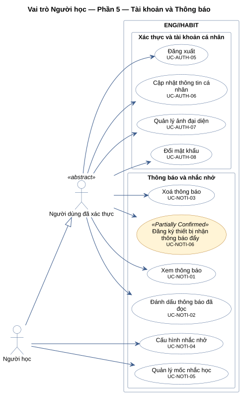
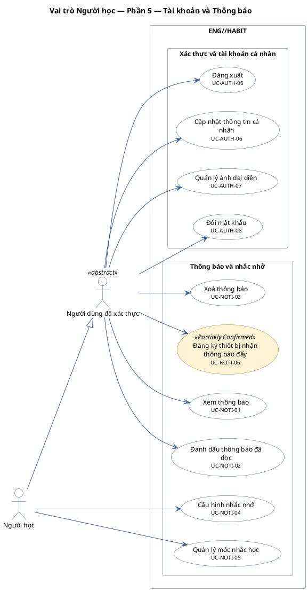

# Vai trò Người học

Mọi use case một tài khoản `USER` dùng được: các use case gắn với Người học, cộng các use case gắn với actor cha Người dùng đã xác thực (vẽ qua quan hệ generalization). Không gồm quyền Trưởng nhóm — xem `role-group-leader-use-case.md`.

Tổng số use case của vai trò trong tài liệu này: 60, chia thành 5 sơ đồ theo nhóm module để giữ sơ đồ dễ đọc.

**Cách đọc:** hình người là actor, hình elip là use case, khung ngoài là ranh giới hệ thống
`ENG//HABIT`, khung trong là module. Mũi tên liền từ actor tới use case là association;
mũi tên nét đứt `<<include>>` trỏ từ use case gốc tới use case luôn được gọi; `<<extend>>` trỏ từ
use case mở rộng tới use case gốc; mũi tên tam giác rỗng là generalization (con → cha).
Use case nền vàng mang nhãn `<<Partially Confirmed>>`: có bằng chứng ở mã nguồn nhưng chưa đủ
(xem cột Trạng thái trong `USE-CASE-INVENTORY.md`).

## Vai trò Người học — Phần 1 — Thư viện, Học và Ôn tập

14 use case.

| ID | Use Case | Actor (association) | Trạng thái |
|---|---|---|---|
| UC-LIB-01 | Tìm kiếm bộ thẻ công khai | Người học | Confirmed |
| UC-LIB-02 | Xem bộ thẻ của tôi | Người học | Confirmed |
| UC-LIB-03 | Xem chi tiết bộ thẻ | Người học | Confirmed |
| UC-LIB-04 | Quản lý bộ thẻ của tôi | Người học | Confirmed |
| UC-LIB-05 | Nhập bộ thẻ mới từ tệp | Người học | Confirmed |
| UC-LIB-06 | Quản lý thẻ trong bộ | Người học | Confirmed |
| UC-LIB-07 | Nhập thẻ từ tệp vào bộ | Người học | Confirmed |
| UC-LIB-08 | Chia sẻ liên kết bộ thẻ | Người học | Confirmed |
| UC-LIB-09 | Báo cáo vi phạm bộ thẻ | Người học | Confirmed |
| UC-STU-01 | Học bộ thẻ | Người học | Confirmed |
| UC-STU-02 | Ôn tập thẻ theo lịch | Người học | Confirmed |
| UC-STU-03 | Ôn nhanh (Cram) | Người học | Confirmed |
| UC-STU-04 | Trả lời và chấm thẻ | — (chỉ qua quan hệ) | Confirmed |
| UC-STU-05 | Ghi nhận hoàn thành phiên học | — (chỉ qua quan hệ) | Confirmed |
| UC-STU-06 | Xem thống kê học và ôn | Người học | Confirmed |
| UC-STU-07 | Xem lịch sử ôn tập | Người học | Confirmed |

## Vai trò Người học — Phần 2 — Thói quen, Mục tiêu, Thống kê

9 use case.

| ID | Use Case | Actor (association) | Trạng thái |
|---|---|---|---|
| UC-HAB-01 | Quản lý thói quen | Người học | Partially Confirmed |
| UC-HAB-02 | Check-in thói quen | Người học | Confirmed |
| UC-HAB-03 | Check-in bù thói quen | Người học | Partially Confirmed |
| UC-HAB-04 | Xem lịch sử và tỷ lệ hoàn thành thói quen | Người học | Confirmed |
| UC-HAB-05 | Quản lý mục tiêu | Người học | Confirmed |
| UC-HAB-06 | Xem tiến độ mục tiêu | Người học | Confirmed |
| UC-STAT-01 | Xem tổng quan học tập | Người học | Confirmed |
| UC-STAT-02 | Xem báo cáo học tập | Người học | Confirmed |
| UC-STAT-03 | Xem bảng xếp hạng | Người học | Confirmed |

## Vai trò Người học — Phần 3 — Phần thưởng và Cửa hàng

9 use case.

| ID | Use Case | Actor (association) | Trạng thái |
|---|---|---|---|
| UC-REW-01 | Điểm danh nhận xu | Người học | Confirmed |
| UC-REW-02 | Nhận thưởng nhiệm vụ ngày | Người học | Confirmed |
| UC-REW-03 | Mua vật phẩm giữ chuỗi | Người học | Confirmed |
| UC-SHOP-01 | Xem và tìm vật phẩm | Người học | Confirmed |
| UC-SHOP-02 | Mua vật phẩm | Người học | Confirmed |
| UC-SHOP-03 | Đánh dấu yêu thích vật phẩm | Người học | Confirmed |
| UC-SHOP-04 | Xem kho vật phẩm | Người học | Confirmed |
| UC-SHOP-05 | Sử dụng hoặc bỏ dùng vật phẩm | Người học | Confirmed |
| UC-SHOP-06 | Xem ví xu | Người học | Confirmed |

## Vai trò Người học — Phần 4 — Cộng đồng và Nhóm lớp

18 use case.

| ID | Use Case | Actor (association) | Trạng thái |
|---|---|---|---|
| UC-COM-01 | Xem và tìm bài viết | Người dùng đã xác thực | Confirmed |
| UC-COM-02 | Xem chi tiết bài viết | Người dùng đã xác thực | Confirmed |
| UC-COM-03 | Đăng bài viết | Người dùng đã xác thực | Confirmed |
| UC-COM-04 | Bình luận bài viết | Người dùng đã xác thực | Confirmed |
| UC-COM-05 | Thả tim bài viết | Người dùng đã xác thực | Confirmed |
| UC-COM-06 | Xoá bài viết | Người dùng đã xác thực | Confirmed |
| UC-COM-07 | Xoá bình luận | Người dùng đã xác thực | Confirmed |
| UC-COM-08 | Tải tệp đính kèm | Người dùng đã xác thực | Confirmed |
| UC-GRP-01 | Xem nhóm của tôi | Người học | Confirmed |
| UC-GRP-02 | Tìm nhóm công khai | Người học | Confirmed |
| UC-GRP-03 | Tìm nhóm bằng mã | Người học | Confirmed |
| UC-GRP-04 | Tạo nhóm | Người học | Confirmed |
| UC-GRP-05 | Tham gia nhóm | Người học | Confirmed |
| UC-GRP-06 | Rời nhóm | Người học | Confirmed |
| UC-GRP-07 | Xem bảng tin nhóm | Người học | Confirmed |
| UC-GRP-08 | Đăng bài trong nhóm | Người học | Confirmed |
| UC-GRP-09 | Xem tài liệu nhóm | Người học | Confirmed |
| UC-GRP-10 | Xem bộ thẻ của nhóm | Người học | Confirmed |

## Vai trò Người học — Phần 5 — Tài khoản và Thông báo

10 use case.

| ID | Use Case | Actor (association) | Trạng thái |
|---|---|---|---|
| UC-AUTH-05 | Đăng xuất | Người dùng đã xác thực | Confirmed |
| UC-AUTH-06 | Cập nhật thông tin cá nhân | Người dùng đã xác thực | Confirmed |
| UC-AUTH-07 | Quản lý ảnh đại diện | Người dùng đã xác thực | Confirmed |
| UC-AUTH-08 | Đổi mật khẩu | Người dùng đã xác thực | Confirmed |
| UC-NOTI-01 | Xem thông báo | Người dùng đã xác thực | Confirmed |
| UC-NOTI-02 | Đánh dấu thông báo đã đọc | Người dùng đã xác thực | Confirmed |
| UC-NOTI-03 | Xoá thông báo | Người dùng đã xác thực | Confirmed |
| UC-NOTI-04 | Cấu hình nhắc nhở | Người học | Confirmed |
| UC-NOTI-05 | Quản lý mốc nhắc học | Người học | Confirmed |
| UC-NOTI-06 | Đăng ký thiết bị nhận thông báo đẩy | Người dùng đã xác thực | Partially Confirmed |
