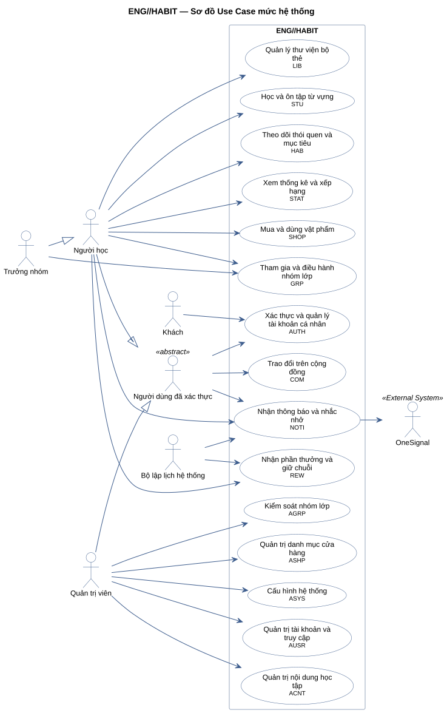
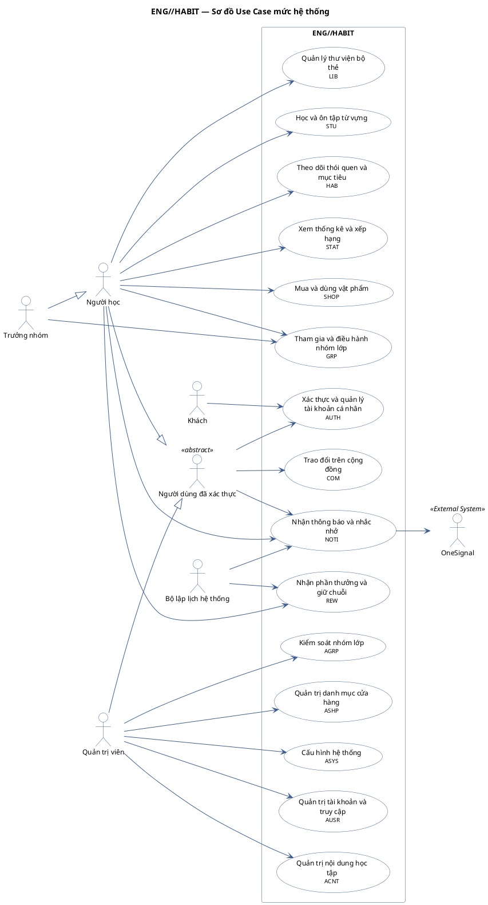

# ENG//HABIT — Use Case mức hệ thống

Sơ đồ tổng quan: mỗi hình elip là một **use case tóm tắt** (summary-level) đại diện cho cả
một module; chi tiết nằm ở sơ đồ module tương ứng. Association ở đây được **suy ra** từ các
use case chi tiết: actor nối với module khi actor đó có ít nhất một use case trong module.
Actor phụ OneSignal nối theo chiều từ hệ thống ra.

**Cách đọc:** hình người là actor, hình elip là use case, khung ngoài là ranh giới hệ thống
`ENG//HABIT`, khung trong là module. Mũi tên liền từ actor tới use case là association;
mũi tên nét đứt `<<include>>` trỏ từ use case gốc tới use case luôn được gọi; `<<extend>>` trỏ từ
use case mở rộng tới use case gốc; mũi tên tam giác rỗng là generalization (con → cha).
Use case nền vàng mang nhãn `<<Partially Confirmed>>`: có bằng chứng ở mã nguồn nhưng chưa đủ
(xem cột Trạng thái trong `USE-CASE-INVENTORY.md`).

## Mã nguồn PlantUML

## Use case tóm tắt

| Mã | Use case tóm tắt | Module | Số use case chi tiết | Sơ đồ chi tiết |
|---|---|---|---|---|
| AUTH | Xác thực và quản lý tài khoản cá nhân | Xác thực và tài khoản cá nhân | 8 | [module-auth-use-case.md](module-auth-use-case.md) |
| LIB | Quản lý thư viện bộ thẻ | Thư viện bộ thẻ | 9 | [module-library-use-case.md](module-library-use-case.md) |
| STU | Học và ôn tập từ vựng | Học và ôn tập | 7 | [module-study-use-case.md](module-study-use-case.md) |
| HAB | Theo dõi thói quen và mục tiêu | Thói quen và mục tiêu | 6 | [module-habits-goals-use-case.md](module-habits-goals-use-case.md) |
| STAT | Xem thống kê và xếp hạng | Thống kê và xếp hạng | 3 | [module-statistics-use-case.md](module-statistics-use-case.md) |
| REW | Nhận phần thưởng và giữ chuỗi | Phần thưởng | 4 | [module-rewards-use-case.md](module-rewards-use-case.md) |
| SHOP | Mua và dùng vật phẩm | Cửa hàng, ví và kho vật phẩm | 6 | [module-shop-use-case.md](module-shop-use-case.md) |
| COM | Trao đổi trên cộng đồng | Cộng đồng | 8 | [module-community-use-case.md](module-community-use-case.md) |
| GRP | Tham gia và điều hành nhóm lớp | Nhóm lớp | 18 | [module-groups-use-case.md](module-groups-use-case.md) |
| NOTI | Nhận thông báo và nhắc nhở | Thông báo và nhắc nhở | 8 | [module-notifications-use-case.md](module-notifications-use-case.md) |
| AUSR | Quản trị tài khoản và truy cập | Quản trị tài khoản và truy cập | 9 | [module-admin-accounts-use-case.md](module-admin-accounts-use-case.md) |
| ACNT | Quản trị nội dung học tập | Quản trị nội dung và kiểm duyệt bộ thẻ | 7 | [module-admin-content-use-case.md](module-admin-content-use-case.md) |
| AGRP | Kiểm soát nhóm lớp | Quản trị nhóm lớp | 5 | [module-admin-groups-use-case.md](module-admin-groups-use-case.md) |
| ASHP | Quản trị danh mục cửa hàng | Quản trị cửa hàng | 2 | [module-admin-shop-use-case.md](module-admin-shop-use-case.md) |
| ASYS | Cấu hình hệ thống | Cấu hình hệ thống và thông báo chung | 2 | [module-admin-system-use-case.md](module-admin-system-use-case.md) |
